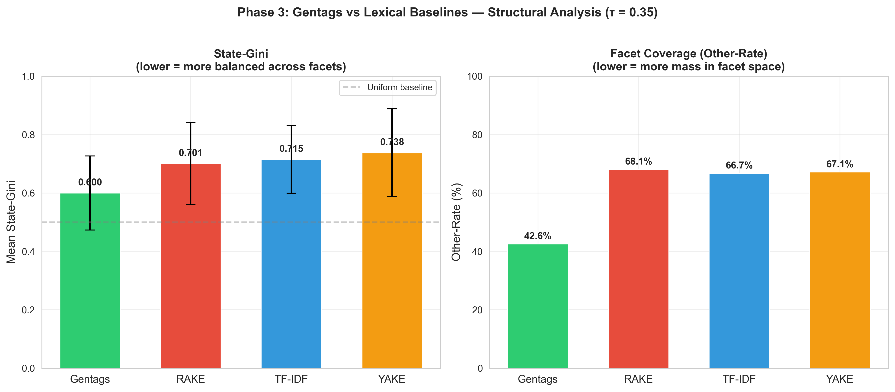
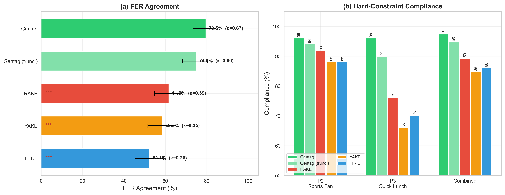
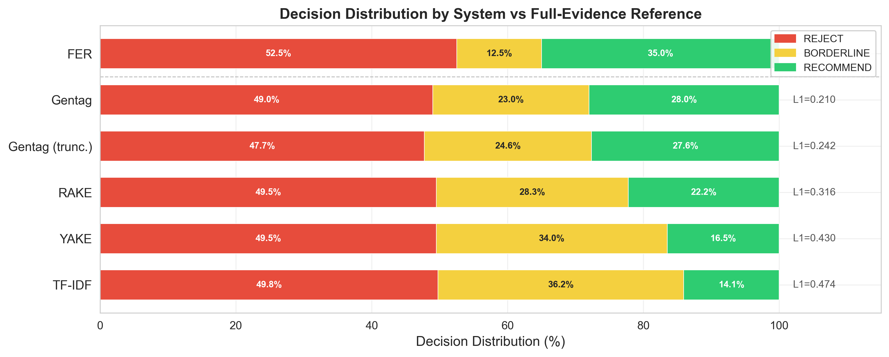
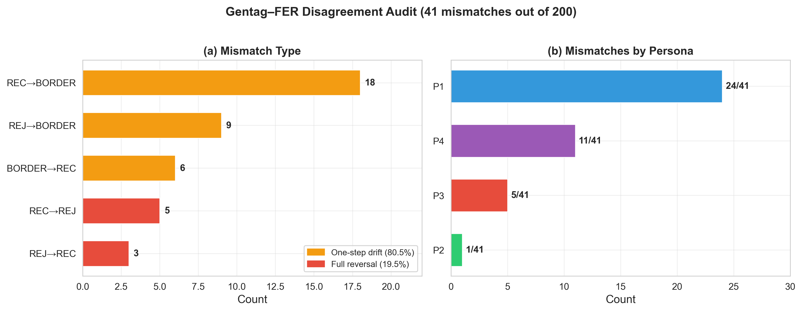
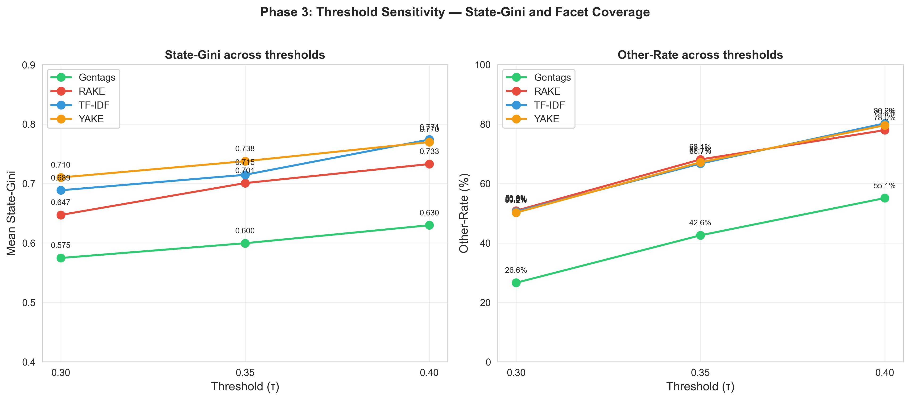
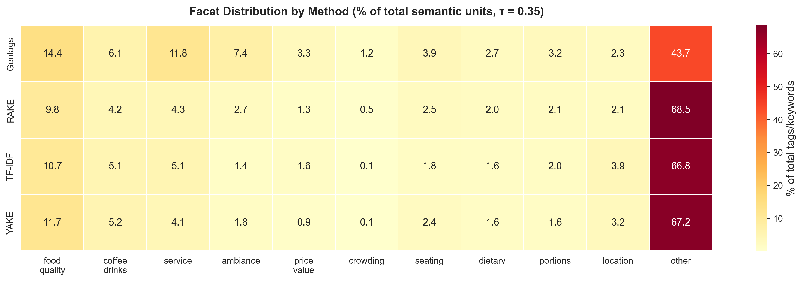
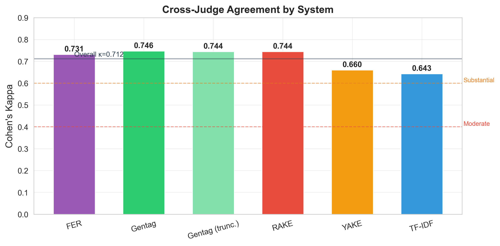

# Gentags: Discrete Semantic Representations for Reliable Constraint-Sensitive Decisions in LLM Pipelines

## Abstract

Large language model (LLM) pipelines increasingly rely on free-form text to drive decisions under explicit constraints, yet lack an explicit, inspectable semantic state prior to decision-making. We identify the structure of this intermediate semantic state as a key, underexplored design variable affecting reliability and controllability in such systems.

To study this, we introduce **Gentags**, a discrete representation that externalizes semantic information as short, evidence-grounded propositional units. Gentags enable semantic state to be inspected, compared across runs, and modified prior to decision-making, allowing controlled analysis of how representation structure impacts system behavior.

We evaluate the effect of semantic state structure by comparing Gentags to lexical baselines (RAKE, YAKE, TF-IDF), which provide alternative compressed representations of the same source text, across three dimensions: stability across runs, prompts, and models; structural properties such as facet coverage and organization; and downstream decision-making in a controlled setting with 50 venues and four personas with hard constraints.

We find that discrete, externalized semantic state leads to substantially improved reliability: Gentags are more stable at the semantic level, achieve broader and more structured coverage, and increase agreement with Full-Evidence Reference (FER) decisions to 79.5% (vs. 52.3–61.6%) while improving hard-constraint compliance to 97.3% (vs. 84.7–89.3%) under matched conditions.

These results demonstrate that semantic state structure is a critical factor in constraint-sensitive LLM systems, and that discrete propositional representations provide a more reliable interface than fragment-level lexical alternatives.

## 1. Introduction

Large language model (LLM)-based systems are increasingly used in pipelines where free-form natural language inputs inform downstream decisions. In many such settings, systems must evaluate requirements and apply explicit constraints based on narrative inputs such as reviews, policies, transcripts, or descriptions. However, these pipelines typically lack a standardized, reusable semantic state abstraction that can be directly inspected or modified prior to decision-making. Instead, semantic information remains embedded in raw text, encoded in dense vector representations for retrieval, or expressed through unstructured summaries. While these forms support retrieval and generation, they do not provide an explicit, addressable semantic state that can be directly compared, selectively modified, or systematically evaluated at the level of representation. As a result, the basis of constraint-sensitive decisions is difficult to audit or control.

We study **constraint-sensitive decisions**, where explicit, checkable requirements govern whether an outcome is acceptable. Prior systems externalize intermediate information in several ways. Retrieval-augmented generation (RAG) uses external retrieval stores to provide supporting evidence during generation (Lewis et al., 2020). Agent architectures externalize information through textual trajectories or memory buffers: **ReAct** interleaves reasoning, actions, and observations in a prompt trajectory (Yao et al., 2023); **Generative Agents** maintain a natural-language memory stream and synthesize higher-level reflections over time (Park et al., 2023); and **Reflexion** stores reflective text for reuse across subsequent trials (Shinn et al., 2023). These approaches support retrieval, acting, and memory reuse, but the effect of **semantic state structure itself** on constraint-sensitive decision reliability has received limited direct evaluation.

This raises a concrete representational question: when semantic information is externalized before decision-making, does the **structure of that representation** affect how reliably a system satisfies explicit constraints?

In this work, we investigate whether representing semantic content as discrete, evidence-conditioned propositions improves constraint-sensitive decision reliability in LLM-based systems relative to alternative text-derived representations. We introduce Gentags, a representation that externalizes semantic information as short propositional units derived from source text. Because these units are discrete and individually addressable, the resulting representation functions as an explicit semantic state that can be inspected, compared across runs, and selectively modified prior to decision-making. Gentags therefore operationalize semantic state as a structured intermediate representation for decision-oriented LLM pipelines.

We evaluate Gentags in a constraint-sensitive decision setting involving 50 venues, four personas with explicit hard requirements, and multiple lexical baselines (RAKE, YAKE, TF-IDF). Our design isolates representational structure while controlling for state size, judge model, aggregation procedure, and constraint specification. Using majority-vote aggregation (N=5) and two independent judge models, we measure hard-constraint compliance and agreement with Full-Evidence Reference (FER) decisions. In this setting, discrete propositional semantic state improves constraint-sensitive decision reliability relative to fragment-level lexical baselines, including under token-matched conditions that control for information volume.

This work makes three contributions. First, we frame semantic state structure as an architectural variable in LLM-based decision pipelines. Second, we introduce Gentags as a discrete propositional semantic state representation for constraint-sensitive tasks. Third, we provide controlled empirical evidence that propositional state structure improves decision reliability relative to fragment-level lexical representations in this setting.

# 2 Related Work

## 2.1 Structured Representations from Language

A long line of work has studied how to derive structured representations of meaning from natural language. **Semantic parsing** maps text into formal representations such as logical forms or executable programs (e.g., Zettlemoyer and Collins, 2005; Dong and Lapata, 2016). These approaches produce structured representations that support reasoning and decision-making, but they typically rely on predefined schemas and are designed for specific tasks.

Related work in **information extraction** aims to identify structured facts or relations from text, often in the form of tuples or triples (e.g., Banko et al., 2007). Open information extraction systems extract relational units without requiring a fixed schema, but the resulting representations are oriented toward relational knowledge rather than general-purpose semantic state for downstream decision processes.

These approaches demonstrate that structured meaning can be derived from text, but they do not provide a schema-free, reusable representation of semantic state designed for flexible decision pipelines.

---

## 2.2 Intermediate Representations in Language Models

Recent work on large language models has explored the use of intermediate representations to improve reasoning. Techniques such as chain-of-thought prompting (Wei et al., 2022) and least-to-most prompting (Zhou et al., 2022) encourage models to produce structured reasoning traces that decompose complex problems.

These representations improve reasoning performance by making intermediate steps explicit, but they are typically **transient**: they are generated for a single inference and are not stored or reused as persistent state across decisions.

---

## 2.3 Externalized State in LLM Systems

Several recent systems externalize information from language models into persistent memory structures. Architectures such as ReAct (Yao et al., 2023), Reflexion (Shinn et al., 2023), and generative agents (Park et al., 2023) maintain external traces, reflections, or memory streams that influence future behavior. Systems such as MemGPT (Packer et al., 2023) further formalize memory management for long-context interactions.

These approaches externalize information to support multi-step reasoning and long-horizon behavior. However, the externalized representations typically consist of **unstructured text, trajectories, or memory logs**, rather than discrete semantic units that function as an explicit state representation.

---

## 2.4 Text-Derived Representations

Traditional approaches represent text using lexical or statistical features, including TF-IDF (Salton and Buckley, 1988) and keyphrase extraction methods such as RAKE (Rose et al., 2010) and YAKE (Campos et al., 2020). These methods produce discrete textual units or weighted features derived from surface forms.

While such representations are widely used for retrieval and summarization, they do not explicitly encode semantic structure in a form designed for downstream decision-making under constraints.

---

## 2.5 Positioning

Prior work has explored structured meaning representations, intermediate reasoning traces, and externalized memory in language model systems. However, these approaches either rely on predefined schemas, produce task-specific or transient outputs, or do not yield discrete, reusable semantic state representations. In contrast, this work studies **schema-free, discrete semantic state representations** and evaluates their impact on downstream decision reliability.

---

# 3 Gentags

## 3.1 Definition

A **gentag** is a short, evidence-conditioned, schema-free semantic descriptor extracted from source text and represented as a discrete externalized unit. Each gentag denotes a property, attribute, or entity associated with the described entity and represents a semantic feature supported by the provided evidence rather than a verified world fact.

Gentags are therefore **derived from textual evidence rather than ground truth**. They represent semantic features implied by the source text and do not attempt to verify the factual accuracy of the underlying claims.


---

## 3.2 Extraction

Gentags are produced by prompting a large language model with textual evidence and requesting short semantic descriptors grounded in the input text. No predefined label set or ontology is supplied; the model generates tags freely based on the evidence.

Given textual evidence _E_, extraction produces a gentag state

_S_ = *f*θ(_E_)

where *f*θ denotes the extraction model parameterized by θ. The resulting state

_S_ = {*g*1, *g*2, …, *g*n}

is an unordered set of gentags representing semantic features supported by the evidence. The number of tags _n_ varies depending on the information contained in the source text.

Extraction is performed in a zero-shot setting, meaning that the model receives only the evidence and instructions to produce short semantic descriptors grounded in the text. Implementation details, including prompts and model configurations, are provided in the appendix.

---

## 3.3 Gentag State Representation

The gentag state of an entity is represented as a finite set of discrete semantic units:

_S_ = {*g*1, *g*2, …, *g*n}.

Each unit *g*i is a short natural-language string representing a semantic feature supported by the evidence. The set _S_ therefore forms an explicit semantic state abstraction derived from the source text.

Unlike dense embeddings, which encode meaning in continuous vector spaces, and unlike raw text, which embeds meaning in unstructured narrative, the Gentags representation exposes semantic features as individually addressable units. These units can be inspected directly, compared across entities, and evaluated against decision constraints.

---

## 3.4 Representation Properties

The gentag representation has several properties that distinguish it from alternative text-derived representations.

**Discrete.** Each gentag is a separable unit, and the state is a finite set of bounded strings rather than a continuous vector or paragraph of text.

**Schema-free.** Gentags are not drawn from a predefined taxonomy or label set. The vocabulary emerges from the interaction between the language model and the evidence.

**Externalized.** The semantic state is stored outside the language model as persistent data, allowing it to be cached, compared, and reused independently of the extraction model.

**Evidence-conditioned.** Each gentag is grounded in the provided source text. The representation therefore reflects semantic features supported by the evidence rather than arbitrary model-generated descriptions.

**Inspectable.** Because gentags are natural-language strings, the resulting state can be directly read and interpreted by humans without additional decoding or projection.

# 4 Experimental Setup

We evaluate Gentags through three complementary studies targeting different properties of the representation: **stability**, **structural organization**, and **downstream decision utility**. Across all studies, comparisons are performed at the representation level, and the underlying textual evidence and evaluation protocols are held fixed wherever possible.

---

## 4.1 Data

All studies draw from a shared executed extraction corpus of 553 venues. In the canonical Phase 1 subset used by the repo, venues contain 1–5 review objects each. Gentags and all baseline representations are derived from this same underlying evidence.

Different studies operate on fixed subsets of this corpus depending on their requirements. Stability and structural analyses use a subset of venues with successful extractions across all models to enable controlled comparison. The decision evaluation uses a stratified subset of 50 venues designed to ensure coverage of key constraint-relevant attributes (e.g., sports viewing and service speed).

---

## 4.2 Representations and Baselines

The primary object of study is the **gentag state**, defined as a set of short, evidence-conditioned semantic units extracted from text.

We compare Gentags to several text-derived baseline representations constructed from the same review evidence:

- **RAKE**: keyword phrases extracted using Rapid Automatic Keyword Extraction
- **YAKE**: unsupervised keyphrase extraction based on local features
- **TF-IDF**: top-weighted n-grams or phrases
- **gentag_truncated**: gentags truncated to match the number of RAKE phrases per instance
- **FER (Full-Evidence Reference)**: raw review text provided directly to the decision model

All comparisons are **representation-to-representation**: the underlying evidence, prompts, and evaluation procedures are held constant, and only the representation of semantic content varies.

The **gentag_truncated** condition controls for representation size. If truncated Gentags outperform lexical baselines under equal-length conditions, performance differences can be attributed to semantic structure rather than information volume.

---

## 4.3 Study Design

### Stability Analysis

The stability study evaluates whether Gentags behave as a recoverable semantic representation under variation in extraction conditions. Extractions are performed across multiple language models, prompt variants, and repeated runs. Stability is assessed by comparing outputs for the same input under these variations.

### Structural Analysis

The structural analysis evaluates how semantic content is organized within each representation. Tags and baseline phrases are mapped to a fixed set of diagnostic semantic facets using embedding-based similarity. This enables measurement of how concentrated or dispersed semantic information is across interpretable dimensions.

All representations are evaluated under the same facet definitions, embedding model, and assignment procedure.

### Decision Evaluation

The decision study evaluates whether representations preserve decision-relevant information in a constraint-sensitive setting. Each condition consists of a venue, a persona, and a representation. A model receives only the representation and produces a decision.

We evaluate 50 venues, 4 personas, and 6 representation conditions, with repeated model evaluations per condition and majority-vote aggregation.

---

## 4.4 Personas and Constraints

The decision evaluation uses four personas. Three impose explicit hard constraints, and one serves as a soft-preference control:

- **Food Critic**: must reject venues with negative food-quality indicators
- **Sports Fan**: must reject venues lacking sports-viewing indicators
- **Quick Lunch Worker**: must reject venues lacking fast-service indicators
- **Balanced Diner**: no hard constraints

Constraint evaluation is based on fixed indicator lexicons. These lexicons are held constant across all representations and are not tuned post hoc.

---

## 4.5 Evaluation Protocol

Decision evaluation is performed using language models acting as judges. The primary judge is GPT-4o, and results are validated using a second independent model.

Each condition is evaluated multiple times, and final decisions are obtained via majority vote. Invalid outputs are discarded, and conditions with insufficient valid responses are excluded from analysis.

For structured representations, the judge is required to return decisions along with explicit supporting and blocking evidence drawn only from the provided representation. Validation enforces that all cited evidence must be a subset of the input representation.

---

## 4.6 Controlled Factors

The experimental design isolates the effect of representation structure by controlling other variables:

- **Fixed evidence**: All representations for a given instance are derived from the same underlying text
- **Fixed evaluation protocol**: Prompts, decision criteria, and aggregation procedures are identical across representations
- **Frozen constraints**: Persona definitions and indicator lexicons are fixed in advance
- **Controlled representation size**: The truncated gentag condition matches baseline length
- **Cross-model validation**: Decision evaluation is repeated with an independent judge model

Under this design, differences in downstream performance are consistent with variation in how representations preserve and expose decision-relevant semantic content.

## **5. Analysis / Results**

The empirical results are organized around the three claims of the paper. First, if Gentags are to function as an externalized semantic state, they must be recoverable across repeated extractions, prompts, and extractor models. Second, if they are to be more than a stylistic rewriting of reviews, they must exhibit a useful structural organization relative to lexical baselines. Third, if that structure matters in practice, it should improve downstream constraint-sensitive decisions relative to fragment-level keyword representations.

The studies therefore proceed in three layers. The first evaluates representation stability. The second evaluates structural organization through facet coverage and State-Gini. The third evaluates downstream decision utility under explicit hard constraints. Across all three layers, Gentags are compared against text-derived alternatives under matched protocols rather than against unrelated systems or tasks.

For the decision study, each condition consists of a **venue**, a **persona**, and a **representation**. A judge model receives only the supplied representation and produces a decision. This allows the downstream evaluation to isolate the information carried by the representation itself.

## **5.1 Stability Analysis**

The stability results ask whether Gentags behave like a recoverable semantic state rather than a brittle surface artifact. The core empirical pattern is the same across all stability tests: wording changes substantially, but meaning remains highly stable.

### **5.1.1 Run-to-run Stability**

The most basic question is whether repeated extractions under the same model and prompt recover the same semantic content. Across repeated runs, Gentags show very high semantic consistency despite substantial lexical variation.

| Metric                                            | Median    | Q1    | Q3    |
| ------------------------------------------------- | --------- | ----- | ----- |
| Semantic cosine                                   | **0.977** | 0.968 | 0.986 |
| Surface Jaccard                                   | **0.471** | 0.333 | 0.625 |
| Mean Max Cosine (semantic paraphrase consistency) | **0.887** | 0.839 | 0.927 |
| Semantic-surface gap                              | **0.504** | —     | —     |

Two things matter in this table. First, semantic cosine is extremely high: repeated runs recover nearly the same point in semantic space. Second, surface overlap is much lower. The gap between these two metrics shows that a large share of the variation lies in paraphrase, compression, and lexical choice rather than in semantic drift (Figure 2).


This pattern is also visible by model. Claude and Grok produce the highest surface overlap, while Gemini and OpenAI show more paraphrastic variation. But all four models remain in the same basic regime: high semantic similarity and clearly lower lexical overlap.

| Model  | Cosine | Jaccard | Mean Max Cosine |
| ------ | ------ | ------- | --------------- |
| Claude | 0.982  | 0.574   | 0.913           |
| Gemini | 0.971  | 0.404   | 0.869           |
| Grok   | 0.975  | 0.722   | 0.876           |
| OpenAI | 0.975  | 0.387   | 0.861           |

The implication is straightforward. Gentags do not require exact lexical reproducibility to be stable. They are stable in the stronger sense relevant for representation: repeated extraction recovers substantially the same meaning even when the tag strings are not identical (Figure 3).


### **5.1.2 Prompt Sensitivity**

The next question is whether prompt wording changes the recovered semantic state or merely changes its resolution and style. Across all prompt pairs, semantic similarity remains high.

| Prompt Pair                       | Mean Cosine | Mean Jaccard |
| --------------------------------- | ----------- | ------------ |
| anti_hallucination ↔ minimal      | **0.966**   | 0.321        |
| anti_hallucination ↔ short_phrase | **0.962**   | 0.282        |
| minimal ↔ short_phrase            | **0.966**   | 0.352        |

This result shows that prompt variation affects how the state is phrased and compressed, but not the core semantic content it recovers. The `anti_hallucination` prompt tends to produce more grounded and granular tags; `short_phrase` tends to compress them; `minimal` sits between the two. Yet the cross-prompt cosine remains above 0.95 throughout.

That matters methodologically. A representation that only exists under a single fragile prompt would be hard to defend as a reusable state abstraction. Gentags are more robust than that. Prompt changes alter surface form and granularity, but the same underlying venue semantics remain recoverable.

A second prompt-level pattern also emerges from the run-stability summaries. Across all four extractor models, the `anti_hallucination` prompt produces the **highest rerun Jaccard overlap**, and it also produces the highest cosine and Mean Max Cosine values. However, these should not be read as evidence that `anti_hallucination` yields a materially different semantic state. The absolute semantic gains are small: relative to `minimal`, cosine improves by only about **0.007-0.009** across models, and relative to `short_phrase` by about **0.007-0.013**. Mean Max Cosine increases somewhat more, by roughly **0.026-0.045**, but all prompts remain in the same high-semantic-similarity regime. By contrast, Jaccard increases much more visibly, by roughly **0.044-0.141**.

Paired Wilcoxon tests confirm this asymmetry. For all four models, `anti_hallucination` is significantly higher than the other prompts on rerun Jaccard, and in most cases also significantly higher on cosine and Mean Max Cosine. But because the number of venues is large, statistical significance alone would overstate the semantic effect. The defensible interpretation is therefore practical rather than purely statistical: stronger anti-hallucination instructions make the extracted **surface form** more repeatable, while the recovered **semantic content** is already highly stable across prompts.

### **5.1.3 Cross-model Agreement**

The strongest recoverability test is cross-model agreement. If multiple extractor models recover closely aligned gentag states from the same evidence, the representation is harder to dismiss as a model-specific artifact.

Across model pairs, semantic agreement remains high:

| Model Pair      | Mean Cosine | Mean Jaccard |
| --------------- | ----------- | ------------ |
| Claude ↔ Gemini | 0.951       | 0.253        |
| Claude ↔ Grok   | 0.953       | 0.267        |
| Claude ↔ OpenAI | 0.951       | 0.236        |
| Gemini ↔ Grok   | 0.969       | 0.323        |
| Gemini ↔ OpenAI | 0.958       | 0.248        |
| Grok ↔ OpenAI   | 0.969       | 0.315        |

All pairwise semantic similarities exceed **0.94**, while lexical overlap remains much lower. This is exactly the pattern one would expect if the evidence constrains a shared semantic state but leaves freedom in phrasing and packaging.

The important conclusion here is representation-level stability. The extractor can change, and the wording can change, yet the recovered semantic object remains similar. That is the right kind of robustness for an externalized state representation.

### **5.1.4 Evidence-induced Dispersion**

The final stability question is whether variation behaves meaningfully with respect to evidence. If gentag states are constrained by the source text, sparse evidence should produce less identifiable states and therefore greater dispersion.

That is what the data show. The correlation between evidence quantity and representation dispersion is **-0.230** by Pearson correlation, and this relationship is statistically significant (**p = 0.00045**). A rank-based Spearman check yields a similar result (**rho = -0.263, p = 5.4e-05**), indicating that the negative association is not an artifact of a particular linearity assumption. Lower-token venues show higher mean pairwise distance among recovered states, while better-evidenced venues show lower dispersion.

| Token Bucket | Mean Variability | N Venues |
| ------------ | ---------------- | -------- |
| <200         | **0.0568**       | 104      |
| 200-400      | 0.0465           | 87       |
| 400-600      | 0.0454           | 29       |
| 600-1000     | 0.0462           | 9        |
| >1000        | **0.0424**       | 1        |

The practical size of the effect is modest but meaningful. Venues under 200 tokens have mean variability **0.0568**, compared with **0.0465** for the 200-400 token bucket and **0.0455** for venues with at least 400 tokens. The gap between `<200` and `>=400` is therefore about **0.0113** in absolute terms, or roughly **25%** relative to the higher-evidence group, and this bucket comparison is also significant under a Mann-Whitney test (**p = 0.0339**). By contrast, the comparison against only the very highest-token venues is not stable enough to stand alone, because that bucket is small. The correct interpretation is therefore not a dramatic step change at a single threshold, but a statistically reliable tendency for sparse-evidence venues to exhibit more dispersed recovered states.

This result is conceptually important. Dispersion is not just model noise. It tracks how strongly the evidence constrains the semantic state. Under sparse evidence, multiple plausible gentag states can be recovered; under richer evidence, the state becomes more identifiable. That makes dispersion interpretable as an identifiability signal rather than as arbitrary stochastic failure (Figure 4).


Taken together, the stability results support the first main claim of the paper: Gentags are recoverable enough to function as an externalized semantic state. They are not lexically fixed, but they are semantically stable across reruns, prompts, and extractor models.

## **5.2 Structural Analysis**

The structural analysis asks a different question: what kind of semantic state do Gentags form? The goal is not merely to show that Gentags are stable, but to determine whether they organize semantic content in a more useful way than lexical baselines.

The main probe projects tags or keywords into a shared 10-facet diagnostic space using frozen anchor embeddings and hard assignment with threshold `τ = 0.35`. Items that fail threshold are placed in an explicit `other` bucket. This detail is central: structural claims must be interpreted jointly through **facet coverage** and **State-Gini**, because a representation can appear highly concentrated simply by failing to place much of its semantic mass into the measured facet space.

### **5.2.1 Facet Coverage**

Facet coverage is measured through the fraction of semantic units routed to the explicit `other` bucket. Lower `other_rate` means more semantic mass is captured by the diagnostic facet inventory.

In the full structural run, Gentags show substantially better facet coverage than lexical baselines:

| Method  | Mean tags/keywords per unit | Assigned mean | Other mean | Other rate |
| ------- | --------------------------- | ------------- | ---------- | ---------- |
| Gentags | 21.9                        | 12.3          | 9.6        | **~43%**   |
| RAKE    | 19.5                        | 6.1           | 13.3       | **~68%**   |
| TF-IDF  | 19.8                        | 6.6           | 13.2       | **~67%**   |
| YAKE    | 19.8                        | 6.5           | 13.3       | **~67%**   |

This is the cleanest structural difference between Gentags and the lexical baselines. Gentags place a much larger share of their mass into the diagnostic facet space, while the keyword baselines leave most of their mass below threshold. In practical terms, Gentags recover more units that map onto recognizable decision-relevant aspects of the venue, whereas lexical baselines generate many fragments that are too noisy, too local, or too semantically incomplete to survive thresholding.

This matters because downstream decisions do not operate over all possible text fragments equally. A representation is more useful when more of its mass is interpretable in the relevant semantic space. On that criterion, Gentags outperform RAKE, YAKE, and TF-IDF.

### **5.2.2 State-Gini**

State-Gini measures how concentrated the **assigned** semantic mass is across the 10 facets. On its own, high Gini means that assigned items pile into fewer facets; low Gini means that assigned items are spread more evenly across facets.

The raw State-Gini results are:

| Method  | Mean State-Gini | Std. Dev. |
| ------- | --------------- | --------- |
| Gentags | **0.600**       | 0.127     |
| RAKE    | 0.701           | 0.140     |
| TF-IDF  | 0.715           | 0.116     |
| YAKE    | 0.738           | 0.150     |

At first glance, these numbers could be misread as favoring the baselines, since their Gini values are higher. But interpreted in isolation, that reading would be wrong. The baselines achieve their higher Gini while assigning far fewer units to the facet space at all. Because Gini is computed only on the assigned subset, a method with a very high `other_rate` can appear more concentrated simply because most of its mass has already been excluded.

This is exactly what happens here. RAKE, YAKE, and TF-IDF each assign only about 6 items on average, while Gentags assign more than 12. With so few surviving items, baseline mass naturally looks spikier. Their higher Gini is therefore partly an artifact of low coverage.

The right interpretation is joint:

- **Gentags:** lower `other_rate`, lower Gini
- **Baselines:** higher `other_rate`, higher Gini

That combination indicates that Gentags capture more semantic mass inside the facet inventory and distribute that captured mass across more decision-relevant dimensions. In contrast, the lexical baselines leave most of their mass outside the measured semantic space and concentrate what remains in a few surviving facets. This is better described as **spiky partial coverage** than as a superior structured state (Figure 5).



The structural claim, then, is not that Gentags are more single-facet concentrated than the baselines. It is that Gentags produce a **broader, more balanced, and more semantically covered state** than fragment-level lexical baselines.

### **5.2.3 Threshold Sensitivity**

To test whether the structural pattern is an artifact of a particular threshold, the facet-assignment procedure was rerun at `τ ∈ {0.30, 0.35, 0.40}`.

| τ    | Method  | State-Gini | Other rate (%) |
| ---- | ------- | ---------- | -------------- |
| 0.30 | Gentags | 0.575      | **26.6**       |
| 0.30 | RAKE    | 0.647      | 50.9           |
| 0.30 | TF-IDF  | 0.689      | 50.5           |
| 0.30 | YAKE    | 0.710      | 50.2           |
| 0.35 | Gentags | 0.600      | **42.6**       |
| 0.35 | RAKE    | 0.701      | 68.1           |
| 0.35 | TF-IDF  | 0.715      | 66.7           |
| 0.35 | YAKE    | 0.738      | 67.1           |
| 0.40 | Gentags | 0.630      | **55.1**       |
| 0.40 | RAKE    | 0.733      | 78.0           |
| 0.40 | TF-IDF  | 0.774      | 80.2           |
| 0.40 | YAKE    | 0.770      | 79.6           |

The important result is not the exact Gini movement but the robustness of the coverage gap. At every threshold, Gentags retain more mass within the facet inventory than the lexical baselines. At `τ = 0.30`, Gentags assign roughly three quarters of their mass, while the baselines assign only about half. At `τ = 0.40`, all methods lose coverage, but the baselines deteriorate much more severely.

This threshold sweep strengthens the structural interpretation. The Gentags advantage in facet coverage is not a fragile byproduct of `τ = 0.35`; it persists across a reasonable range of thresholds. The same is true of the underlying structural asymmetry: Gentags retain broader semantic coverage, while lexical baselines become increasingly sparse and spiky as the threshold tightens.

These structural results support a narrower but still substantive claim: Gentags yield a better-covered and more balanced semantic state than lexical fragment baselines. That is the form of structure most relevant for downstream decision tasks.

### **5.2.4 Bleed Check**

Because the structural analysis uses hard argmax assignment, a natural concern is whether many items are only weakly assigned to their winning facet. To test this, we examine the gap between the highest and second-highest facet similarities. If argmax assignments were generally clean, these gaps would be large. If many items sit near facet boundaries, the gaps would be small.

For Gentags, the bleed-check results show that facet boundaries are often soft rather than sharply separated:

| Gentag metric                      | Value     |
| ---------------------------------- | --------- |
| Mean primary-secondary gap         | **0.065** |
| Median gap                         | **0.039** |
| Near-miss rate (`gap < 0.05`)      | **57.4%** |
| Clear-primary rate (`gap >= 0.10`) | **20.5%** |
| Mean primary similarity            | **0.343** |

These numbers mean that a majority of Gentags have a relatively small margin between the best and second-best facet. In other words, many tags are not naturally one-facet objects. They sit near multiple diagnostic axes in embedding space. Only about one fifth have a clearly dominant facet under the current criterion.

The same diagnostic can also be computed for the lexical baselines:

| Method  | Mean gap  | Median gap | `gap < 0.05` | `gap >= 0.10` | Mean primary sim |
| ------- | --------- | ---------- | ------------ | ------------- | ---------------- |
| Gentags | **0.065** | **0.039**  | **57.4%**    | **20.5%**     | **0.343**        |
| RAKE    | 0.056     | 0.030      | 64.0%        | 18.0%         | 0.319            |
| YAKE    | 0.056     | 0.030      | 64.7%        | 18.1%         | 0.318            |
| TF-IDF  | 0.055     | 0.025      | 66.9%        | 17.4%         | 0.321            |

This comparison is useful for two reasons. First, it shows that Gentags are not uniquely ambiguous; in fact, the lexical baselines are slightly **more** boundary-ambiguous by this diagnostic. Second, it weakens a possible objection to the Gentags structural story. The lower State-Gini observed for Gentags is not explained by unusually noisy argmax assignments relative to the baselines. If anything, the baselines exhibit smaller top-two margins and more near-miss assignments.

This does not turn the facet inventory into a clean ontology. All methods show soft boundaries. But it does clarify how to read the structural analysis. The facets are best understood as a **diagnostic probe space**, and Gentags perform at least as well as the baselines under that probe while also achieving much better facet coverage. That makes the joint reporting of `other_rate`, State-Gini, and gap-based ambiguity important for a faithful interpretation of the structural results.

## **5.3 Decision Evaluation**

The decision study tests whether the representational differences observed in the structural analysis matter under explicit downstream constraints. This is the strongest practical test in the paper: if Gentags are a better semantic state, they should better preserve full-evidence decisions and satisfy hard requirements more reliably than fragment-level lexical baselines.

The decision evaluation uses **50 venues**, **4 personas**, and **6 systems**, yielding **1,200 conditions** per judge. The systems are `gentag`, `rake`, `yake`, `tfidf`, `gentag_truncated`, and `fer`. Each condition is evaluated with **N = 5** repeated judge calls and majority-vote aggregation.

### **5.3.1 FER Agreement**

The primary fidelity metric is agreement with **Full-Evidence Reference (FER)** decisions. FER uses the same judge, the same decision rubric, and the same aggregation procedure, but supplies raw reviews rather than a compressed representation. It therefore serves as a reference decision under full evidence, not as a separate task.

Gentags substantially outperform all lexical baselines on FER agreement:

| System           | Matches | Total | Agreement | Kappa     |
| ---------------- | ------- | ----- | --------- | --------- |
| Gentag           | 159     | 200   | **79.5%** | **0.667** |
| RAKE             | 122     | 198   | 61.6%     | 0.388     |
| YAKE             | 117     | 200   | 58.5%     | 0.351     |
| TF-IDF           | 104     | 199   | 52.3%     | 0.258     |
| Gentag truncated | 149     | 199   | 74.9%     | 0.596     |

The pairwise Fisher tests all favor Gentags over the lexical baselines:

| Comparison       | p-value      |
| ---------------- | ------------ |
| gentag vs RAKE   | **0.0001**   |
| gentag vs YAKE   | **0.000008** |
| gentag vs TF-IDF | **<0.0001**  |

These are large gaps, not marginal ones. Gentags exceed RAKE by nearly 18 percentage points, YAKE by 21 points, and TF-IDF by more than 27 points. The kappa results tell the same story. Gentags show substantial agreement with FER, while the lexical baselines fall into the fair-agreement range.

This is the paper's clearest decision-fidelity result: Gentags preserve far more of the decision-relevant content available under full evidence than keyword fragments do (Figure 6).



A concrete example from the actual evaluation data helps make this metric intuitive. For **Coltons's Arcadia** under **P3 Quick Lunch Worker**, the full-evidence reference decision is `RECOMMEND`. The Gentags representation also yields `RECOMMEND`, matching FER. The Gentags for this venue include explicit service signals such as `"fast service"`, `"attentive service"`, `"amazing service"`, and `"excellent service"`. By contrast, the RAKE, YAKE, and TF-IDF representations all yield `REJECT` for the same venue-persona condition. In this case the representation-only decision diverges because the lexical baselines do not preserve the speed signal as clearly or directly as the Gentags representation does. This is exactly what FER agreement measures: whether the compressed representation leads to the same decision that the judge reaches when given the original reviews.

### **5.3.2 Constraint Compliance**

The second main decision metric is hard-constraint compliance. This directly measures whether a representation enables correct decisions under explicit persona requirements.

Combined compliance across the three hard personas is:

| System           | Correct | Total | Compliance |
| ---------------- | ------- | ----- | ---------- |
| Gentag           | 146     | 150   | **97.3%**  |
| FER              | 142     | 150   | 94.7%      |
| Gentag truncated | 141     | 149   | 94.6%      |
| RAKE             | 133     | 149   | 89.3%      |
| TF-IDF           | 129     | 150   | 86.0%      |
| YAKE             | 127     | 150   | 84.7%      |

The associated Fisher tests again favor Gentags:

| Comparison       | p-value    |
| ---------------- | ---------- |
| gentag vs RAKE   | **0.0054** |
| gentag vs YAKE   | **0.0002** |
| gentag vs TF-IDF | **0.0006** |

Per-persona breakdown clarifies where the difference comes from. P1 is effectively a control and does not differentiate systems, because the sample contains no negative food indicators. The real separation comes from P2 and especially P3.

| Persona               | Gentag    | RAKE  | YAKE  | TF-IDF |
| --------------------- | --------- | ----- | ----- | ------ |
| P2 Sports Fan         | **96.0%** | 91.8% | 88.0% | 88.0%  |
| P3 Quick Lunch Worker | **96.0%** | 76.0% | 66.0% | 70.0%  |

P3 is the clearest case. Gentag phrases such as `"fast service"` and `"quick counter service"` communicate the relevant speed signal directly. Lexical fragments such as `"relative quick time"` or `"quick lunch"` are much less decision-legible. The representation does not merely lose nuance; it fails to carry the exact constraint signal the judge needs.

This is the downstream version of the structural story. Gentags better preserve semantically actionable facets, and as a result they better preserve hard-constraint decisions.

### **5.3.3 Token-budget Ablation**

One possible objection is that Gentags might simply work better because they provide more information. The token-budget ablation addresses this by truncating Gentags to match the RAKE tag count for each venue.

Even under this matched-budget condition, Gentags retain a large advantage:

| Metric              | Gentag truncated | RAKE  | YAKE  | TF-IDF |
| ------------------- | ---------------- | ----- | ----- | ------ |
| FER agreement       | **74.9%**        | 61.6% | 58.5% | 52.3%  |
| Combined compliance | **94.6%**        | 89.3% | 84.7% | 86.0%  |

At the level of floor rate, the ablation behaves as intended: once tag count is matched, floor rates are nearly identical. But the fidelity and compliance gaps remain. This is the crucial point. Matching the information budget does not erase the advantage of Gentags, which means the advantage cannot be reduced to simple verbosity.

The ablation therefore isolates the actual representational effect. Gentags work better because of **what they say**, not just because of **how much they say**.

### **5.3.4 Cross-judge Agreement**

To test robustness to evaluator choice, the entire decision study was rerun with a second judge model. The cross-judge results show substantial overall agreement.

| System           | Matches | Total | Agreement | Kappa     |
| ---------------- | ------- | ----- | --------- | --------- |
| FER              | 167     | 199   | 83.9%     | 0.731     |
| Gentag           | 147     | 176   | 83.5%     | 0.746     |
| Gentag truncated | 144     | 173   | 83.2%     | 0.744     |
| RAKE             | 160     | 191   | 83.8%     | 0.744     |
| TF-IDF           | 135     | 178   | 75.8%     | 0.643     |
| YAKE             | 137     | 177   | 77.4%     | 0.660     |
| Overall          | 890     | 1094  | **81.3%** | **0.712** |

The overall kappa of **0.712** indicates substantial agreement between judges. The pattern across systems is also informative. Gentag, FER, and gentag_truncated remain in the most stable region. TF-IDF and YAKE show lower judge agreement, which is consistent with the broader interpretation that more fragmentary representations are harder to interpret consistently.

This matters because it rules out a narrow evaluator artifact. The main decision result is not specific to one judge model.

### **5.3.5 Decision Entropy**

Decision entropy provides a complementary view of representational quality. A useful representation should not only be correct more often; it should also lead to more coherent and decisive downstream behavior.

The entropy analysis shows that gentag decisions track FER much more closely than the lexical baselines:

| System           | H (bits) | P(REJECT) | P(BORDERLINE) | P(RECOMMEND) | L1 vs FER |
| ---------------- | -------- | --------- | ------------- | ------------ | --------- |
| FER              | 1.393    | 52.5%     | 12.5%         | 35.0%        | —         |
| Gentag           | 1.506    | 49.0%     | 23.0%         | 28.0%        | **0.210** |
| Gentag truncated | 1.520    | 47.7%     | 24.6%         | 27.6%        | 0.242     |
| RAKE             | 1.500    | 49.5%     | 28.3%         | 22.2%        | 0.316     |
| YAKE             | 1.460    | 49.5%     | 34.0%         | 16.5%        | 0.430     |
| TF-IDF           | 1.430    | 49.8%     | 36.2%         | 14.1%        | 0.474     |

The lexical baselines systematically shift probability mass away from `RECOMMEND` and into `BORDERLINE`. That pattern is exactly what one would expect from semantically incomplete or opaque representations: they do not only make more mistakes, they also induce more uncertainty. Gentags remain much closer to the full-evidence decision distribution.

This entropy result is important because it shows that Gentags improve not just accuracy-like metrics but the overall decisional shape of downstream inference (Figure 7).



## **5.4 Overall Interpretation**

Across all three empirical layers, the same picture emerges.

The stability analysis shows that Gentags are semantically stable across reruns, prompt variants, and extractor models. This establishes that they are recoverable enough to function as an externalized semantic state.

The structural analysis shows that Gentags place more semantic mass into a shared diagnostic facet space than lexical baselines do. Although the lexical baselines show higher raw Gini, that higher concentration is paired with much worse facet coverage. The right structural interpretation is therefore joint: Gentags yield a better-covered and more balanced semantic state, while lexical baselines are sparse and spiky.

The decision evaluation shows that this representational advantage transfers downstream. Gentags agree more often with full-evidence decisions, satisfy hard constraints more reliably, retain their advantage under token-matched ablation, and produce decision distributions closer to the full-evidence reference. Cross-judge agreement further indicates that the effect is not an artifact of a single evaluator.

Taken together, the results support the central claim of the paper: discrete, evidence-conditioned semantic state improves constraint-sensitive decision reliability in this controlled setting **relative to fragment-level lexical baselines.**

## **6. Discussion**

The results support a specific claim about representation design. Gentags are not merely more readable keyword lists. They function as an externalized semantic state that is stable across extraction conditions, better covered under the structural probe used in the structural analysis, and more faithful to full-evidence downstream decisions than fragment-level lexical baselines. The practical value of this representation is that it makes semantic state explicit: individual units can be inspected, compared, and edited before a decision is made.

At the same time, the qualitative audit shows that the remaining Gentag errors are structured rather than random. Most Gentag-FER mismatches are one-step `BORDERLINE` drifts under mixed evidence, while a smaller subset of exact reversals arises from identifiable protocol or conflict-resolution failures. This makes the discussion section more than a generic limitations list. The error profile points directly to what the current representation does well, what it still leaves unresolved, and which extensions are most likely to matter.

## **6.1 Benefits**

Gentags provide three benefits that matter for constrained downstream systems.

First, they provide an **interpretable semantic state**. Unlike dense embeddings or free-form summaries, Gentags expose individual semantic propositions as discrete units. This makes it possible to inspect the basis of a decision, compare state realizations across runs, and identify which parts of the representation are actually used downstream.

Second, they provide a **schema-free but still structured representation**. Gentags do not require a fixed ontology at extraction time, yet the structural analysis shows that they still occupy a more decision-relevant structural space than lexical baselines. Relative to RAKE, YAKE, and TF-IDF, Gentags achieve broader facet coverage, lower mass in `other`, and less boundary ambiguity under the bleed-check diagnostic.

Third, they provide **better support for explicit constraint-sensitive decisions**. In the decision evaluation, Gentags preserve full-evidence decisions and hard-constraint compliance more reliably than lexical fragments, including under token-matched conditions. This suggests that the main advantage is not just readability or verbosity. It is that Gentags preserve semantically actionable units in a form the downstream judge can use.

Taken together, these benefits support the paper's central framing: semantic state structure is an architectural variable in LLM decision pipelines, and Gentags are one viable design for making that state explicit.

## **6.2 Future Work**

The audit suggests three immediate technical directions.

First, future work should improve **hard-constraint matching** by moving beyond exact string indicators. Semantic indicator matching, lexicon expansion, or lightweight entailment checks would better align the decision protocol with the actual content of the Gentag state. This is the most direct response to FM2, where semantically relevant support is present but invisible to an exact-match rule.

Second, future Gentag variants should support **conflict-aware state resolution**. Cases like `TenTen` suggest that a proposition should not be represented only as a binary presence marker. Useful extensions would include semantic weights, evidence counts, polarity markers, or provenance counts so that a downstream judge can distinguish a lightly supported positive cue from a heavily attested contradictory cue.

Third, the extraction pipeline should retain richer **evidence provenance and uncertainty signals**. Storing source spans, review counts, or confidence-like summaries for each Gentag would make it easier to audit unsupported tags, reason about mixed evidence, and separate strongly grounded propositions from weak or isolated ones. This would also make future qualitative audits less manual.

Beyond these immediate extensions, the evaluation should move into broader and higher-stakes domains. Useful next settings include product reviews, support tickets, policy documents, and news or incident reports. These settings would test whether the advantages observed here transfer when the constraint structure is more open-ended, the evidence is more heterogeneous, or the cost of an incorrect decision is higher.

Another direction is **state canonicalization across time and runs**. The current work shows that Gentags are semantically stable despite surface variation, but longitudinal pipelines will need mechanisms for merging paraphrastic tags, updating stale propositions, and tracking how state changes over time. That would move Gentags closer to a reusable semantic substrate for iterative decision systems rather than a one-shot extraction layer.

One possible future direction is to characterize how individual semantic units differ in how strongly they constrain downstream behavior, potentially relating representation structure to information-theoretic notions of semantic density.

Overall, the current results suggest that Gentags are a useful starting point rather than a finished state model. Their main value is that they make semantic state explicit enough to measure, debug, and improve. The audit reinforces that conclusion: once the representation is externalized, its errors can be categorized, traced, and turned into concrete research directions.

## 7 Conclusion

In this work, we show that the structure of intermediate semantic representations can influence the reliability of constraint-sensitive decisions in LLM-based systems. We introduced Gentags, a representation that externalizes semantic information as discrete, evidence-conditioned propositional units, and evaluated its behavior across stability, structural, and downstream decision analyses.

Our results show that Gentags are recoverable across models and prompts, provide broader and more balanced coverage of decision-relevant semantic facets than lexical baselines, and improve decision consistency in a controlled constraint-sensitive setting. In particular, Gentags achieve higher agreement with Full-Evidence Reference (FER) decisions and higher hard-constraint compliance than fragment-level lexical representations, including under token-matched conditions.

The qualitative audit further shows that remaining failures are structured rather than random. Because Gentags make semantic information explicit, these failures can be inspected, localized, and analyzed directly. Taken together, these results provide evidence that discrete propositional representations can improve decision fidelity and auditability in constraint-sensitive LLM-based decision settings.

---

## 8 Limitations

This study has several limitations.

First, the evaluation is confined to a single restaurant-review decision domain. This domain is useful because it permits controlled hard constraints, repeated extraction, and manual inspection of disagreements, but it is still narrow. The paper therefore shows that Gentags help in this specific constraint-sensitive setting, not that they are universally preferable across all language-system tasks.

Second, the representation currently carries limited information about **uncertainty and evidence strength**. The dominant failure mode in the audit is not catastrophic reversal but mixed-evidence drift into `BORDERLINE` (`33/41` mismatches). This suggests that Gentags often preserve the relevant propositions but do not fully encode how strongly each proposition is supported, how broadly it is attested across reviews, or how decisive it should be under aggregation.

Third, the current pipeline does not fully resolve **contradictory propositions inside the state**. The `TenTen` case is the clearest example: the Gentag state contains both `efficient service` and `slow service`, but the downstream judge anchors on the exact positive indicator and ignores the contradiction. More generally, the representation exposes competing propositions but does not yet provide a principled mechanism for resolving them.

Fourth, part of the remaining error is introduced by the **evaluation protocol itself** rather than by the Gentag representation alone. The audit shows that `4/8` exact `REJECT <-> RECOMMEND` reversals arise from frozen exact-match hard-indicator lexicons. In these cases, the Gentag state contains semantically relevant support such as `fast delivery`, `game audio`, or `nfl game`, but the judge rejects because no exact indicator match is recognized. That means a significant portion of the exact reversals are protocol artifacts rather than clean evidence that Gentags failed to capture the underlying semantic signal.

Fifth, the system does not yet fully normalize **surface variation among semantically equivalent tags**. The stability analysis shows that semantic stability is high despite lower lexical overlap, which is a strength for recoverability, but it also means that canonicalization remains incomplete. Surface variants such as near-paraphrases, morphological variants, or differently scoped phrases may still be treated as distinct units unless a later stage merges them.

Sixth, the extraction stage itself introduces **execution failures** that reduce the effective sample size for aligned analyses. In the extraction grid used for the stability study, these failures are strongly model-specific rather than prompt-specific, with Claude and Grok accounting for the observed unsuccessful runs. Although the retained and excluded venues do not differ detectably by simple review-length proxies, future work should improve schema-constrained extraction robustness so that alignment requirements do not unnecessarily discard otherwise usable cases. Differences in schema adherence across extractor models reduce the effective sample size for aligned multi-model comparisons and highlight the importance of structured output reliability in externalized semantic state pipelines.

Finally, the current paper relies on LLM judges rather than human adjudication for the main downstream evaluation. The use of matched protocols, FER reference decisions, cross-judge replication, and the qualitative audit reduces this concern, but it does not remove it completely. The reported gains are therefore strongest as evidence of comparative representation utility under a controlled judge pipeline.

---

## 9 Ethics Statement

This work studies semantic representations for constrained decision pipelines, not deployment-ready decision systems. The experiments are conducted in a restaurant-review domain with synthetic personas and controlled requirements, which limits immediate real-world risk. However, the broader design space does raise ethical concerns if transferred to higher-stakes settings.

First, both extraction and evaluation depend on language models, which may reflect biases in how they summarize evidence, interpret constraints, or resolve ambiguity. A representation that appears interpretable is not automatically fair or unbiased. In particular, hard-constraint decisions can be sensitive to lexicalization choices, frozen indicator sets, and model-specific output behavior.

Second, externalized semantic state can improve auditability, but it can also create a misleading sense of transparency if users treat extracted semantic units as complete or ground-truth descriptions. Gentags are evidence-conditioned summaries of text, not verified facts about the world.

Third, the present study should not be taken as evidence that this pipeline is appropriate for high-stakes domains such as hiring, credit, healthcare, or legal adjudication. In such settings, representation errors, extraction failures, and judge-model biases could produce harmful outcomes. Any extension to those domains would require domain-specific validation, stronger human oversight, and more careful fairness and safety evaluation than provided here.

## 10 Reproducibility and Materials

The paper is backed by versioned scripts, frozen analysis subsets, run-level outputs, and paper-facing documentation in the project workspace. We intend to release prompts, analysis code, and derived experimental artifacts in anonymized form where licensing and privacy constraints permit.

Some materials may require restricted handling. The underlying review corpus contains third-party platform text and venue-specific data, so raw data release may be limited by platform terms, privacy considerations, or redistribution constraints. Where full release is not possible, a reproducibility package should still include the extraction prompts, evaluation prompts, frozen persona definitions, analysis scripts, manifests, and derived summary tables needed to rerun the reported metrics on an authorized copy of the data.

## References

Banko, Michele, Michael J. Cafarella, Stephen Soderland, Matt Broadhead, and Oren Etzioni. 2007. Open information extraction from the web. In _Proceedings of the 20th International Joint Conference on Artificial Intelligence (IJCAI)_.

Campos, Ricardo, Vitor Mangaravite, Arian Pasquali, Alipio M. Jorge, Celia Nunes, and Adam Jatowt. 2020. YAKE! Keyword extraction from single documents using multiple local features. _Information Sciences_, 509:257-289.

Dong, Li, and Mirella Lapata. 2016. Language to logical form with neural attention. In _Proceedings of the 54th Annual Meeting of the Association for Computational Linguistics (ACL)_.

Lewis, Patrick, Ethan Perez, Aleksandara Piktus, Fabio Petroni, Vladimir Karpukhin, Naman Goyal, Heinrich Kuttler, Mike Lewis, Wen-tau Yih, Tim Rocktaschel, Sebastian Riedel, and Douwe Kiela. 2020. Retrieval-augmented generation for knowledge-intensive NLP tasks. In _Advances in Neural Information Processing Systems (NeurIPS)_.

Packer, Charles, Vivian Fang, Shishir G. Patil, Kevin Lin, Sarah Wooders, and Joseph E. Gonzalez. 2023. MemGPT: Towards LLMs as operating systems. _arXiv preprint arXiv:2310.08560_.

Park, Joon Sung, Joseph O'Brien, Carrie J. Cai, Meredith Ringel Morris, Percy Liang, and Michael S. Bernstein. 2023. Generative agents: Interactive simulacra of human behavior. In _Proceedings of the 36th Annual ACM Symposium on User Interface Software and Technology (UIST)_.

Rose, Stuart, Dave Engel, Nick Cramer, and Wendy Cowley. 2010. Automatic keyword extraction from individual documents. In _Text Mining: Applications and Theory_, pages 1-20. John Wiley & Sons.

Salton, Gerard, and Christopher Buckley. 1988. Term-weighting approaches in automatic text retrieval. _Information Processing & Management_, 24(5):513-523.

Shinn, Noah, Federico Cassano, Ashwin Gopinath, Karthik Narasimhan, and Shunyu Yao. 2023. Reflexion: Language agents with verbal reinforcement learning. In _Advances in Neural Information Processing Systems (NeurIPS)_.

Wei, Jason, Xuezhi Wang, Dale Schuurmans, Maarten Bosma, Brian Ichter, Fei Xia, Ed H. Chi, Quoc V. Le, and Denny Zhou. 2022. Chain-of-thought prompting elicits reasoning in large language models. In _Advances in Neural Information Processing Systems (NeurIPS)_.

Yao, Shunyu, Jeffrey Zhao, Dian Yu, Nan Du, Izhak Shafran, Karthik Narasimhan, and Yuan Cao. 2023. ReAct: Synergizing reasoning and acting in language models. In _The Eleventh International Conference on Learning Representations (ICLR)_.

Zettlemoyer, Luke S., and Michael Collins. 2005. Learning to map sentences to logical form: Structured classification with probabilistic categorial grammars. In _Proceedings of the 21st Conference on Uncertainty in Artificial Intelligence (UAI)_.

Zhou, Denny, Nathanael Schärli, Le Hou, Jason Wei, Xuezhi Wang, Dale Schuurmans, Maarten Bosma, Brian Ichter, Fei Xia, Ed H. Chi, Quoc V. Le, and Tengyu Ma. 2022. Least-to-most prompting enables complex reasoning in large language models. _arXiv preprint arXiv:2205.10625_.

The appendices provide supporting material for claims summarized in the main text. Appendix A documents the implementation details required for reproducibility. Appendix B expands the qualitative audit referenced in the decision results. Appendix C collects supplementary figures with explanatory context.

## Appendix A: Implementation Details

This appendix documents the exact prompts, model configurations, decoding settings, validation rules, and frozen lexicons used throughout the experimental pipeline. All parameters were frozen before data collection and not modified during analysis.

### A.1 Extraction Prompts

Three prompt variants are used for gentag extraction. All instruct the model to produce a JSON list of short semantic phrases grounded in the input reviews. They differ in how strongly they constrain grounding and brevity.

**Minimal prompt:**

> Extract semantic tags ("gentags") for this venue based on the reviews. A gentag is a short, meaningful semantic phrase (typically 1–4 words) that captures one idea expressed or strongly implied in the reviews. Include any gentags that describe atmosphere, food, service, vibe, crowd, or typical occasions mentioned in the reviews. Do not invent information beyond what the reviews support. Return only a JSON list of gentags.

**Anti-hallucination prompt:**

> Extract semantic tags ("gentags") for this venue based ONLY on what is explicitly stated or clearly implied in the reviews. A gentag is a short, meaningful semantic phrase (typically 1–4 words) that captures a single idea grounded in the review text. It must not be a full sentence. Do NOT infer, assume, generalize, or guess any information that is not directly supported by the reviews. If a concept is uncertain, ambiguous, or weakly implied, do NOT include it as a gentag. Include only gentags that reflect concrete statements in the reviews. Return only a JSON list of gentags.

**Short-phrase prompt:**

> Extract semantic tags ("gentags") for this venue that summarize the key ideas expressed in the reviews. A gentag must be a short phrase of 1–4 words that represents one clear semantic idea. Do not produce full sentences. Tags must be grounded in the content of the reviews and should not rely on assumptions or outside knowledge. Return only a JSON list of short gentags.

### A.2 System Prompts

| Provider | System Prompt |
|----------|---------------|
| OpenAI, Grok | `"You extract only JSON lists of gentags based on reviews. No explanations."` |
| Gemini, Claude | None (user prompt only) |

### A.3 Extractor Models

| Key | Model ID | Provider | Input $/Mtok | Output $/Mtok |
|-----|----------|----------|-------------|---------------|
| openai | `gpt-5-nano` | OpenAI | $0.05 | $0.40 |
| gemini | `gemini-2.5-flash` | Google | $0.25 | $0.50 |
| claude | `claude-sonnet-4-5` | Anthropic | $3.00 | $15.00 |
| grok | `grok-4` | xAI | $2.00 | $10.00 |

**Decoding settings for extraction:** Temperature, top_p, and max_tokens are not overridden (provider defaults), except Claude which requires an explicit max_tokens (set to 8192).

### A.4 Output Parsing and Validation

Extraction responses are parsed using three fallback strategies in order:

1. Direct `json.loads()` on the raw response
2. Strip markdown code-fence wrappers (` ```json ... ``` `) and retry
3. Extract the first balanced `[...]` bracket sequence using depth-first bracket tracking

After parsing, tags exceeding 4 words are moved to a `tags_filtered_out` field. Empty and whitespace-only tags are stripped. If all three parsing strategies fail, the extraction is marked `parse_error`. There is no automatic retry.

### A.5 Judge Prompts

**Tag-based systems** (gentag, rake, yake, tfidf, gentag_truncated):

> You are a strict Decision Judge.
>
> Use ONLY the provided tags. Do NOT use external knowledge. Do NOT infer facts not present in the tags. Treat synonyms as NOT present unless they appear exactly in the tag list.
>
> Decision rules:
> - If the persona has a hard requirement and the requirement is VIOLATED based on the provided indicator set, output REJECT.
> - If the persona has a hard requirement and the requirement is SATISFIED, do NOT reject unless other clear blockers exist.
> - RECOMMEND if tags contain clear supports AND no clear blockers.
> - BORDERLINE if tags are mixed or ambiguous.
> - If the persona has no hard requirement, weigh all relevant tags.
>
> Return ONE line of valid JSON and nothing else:
> `{"decision":"REJECT|BORDERLINE|RECOMMEND","requirement_status":"SATISFIED|VIOLATED|NOT_APPLICABLE","blockers":["..."],"supports":["..."],"tags_used":["..."],"justification":"one sentence"}`
>
> Strict rules:
> - tags_used MUST be a subset of the provided tags (exact string match).
> - blockers and supports MUST be subsets of tags_used.
> - If you cite a tag not in the provided list, the response is INVALID.

**Full-Evidence Reference (FER):**

The FER prompt follows the same decision rules but replaces "tags" with "reviews" and requires `evidence_quotes` (short quotes from reviews) instead of `tags_used`.

### A.6 Judge Models and Decoding

| Judge | Model ID | Input $/Mtok | Output $/Mtok |
|-------|----------|-------------|---------------|
| Primary | `gpt-4o-2024-08-06` | $2.50 | $10.00 |
| Cross-validation | `claude-sonnet-4-20250514` | $3.00 | $15.00 |

**Decoding settings:** Temperature and top_p use provider defaults. Max output tokens: 512 (hardcoded for judge responses).

### A.7 Persona Indicator Lexicons

Hard requirements use frozen exact-match indicator sets. The judge checks whether any tag in the representation exactly matches an entry in the corresponding set.

**P1 Food Critic** (`negative_present_rejects`):
- Positive: `delicious food`, `good food`, `excellent food`, `great food`, `quality food`, `fresh food`, `tasty food`, `amazing food`, `fresh ingredients`, `well-prepared food`, `flavorful food`, `outstanding cuisine`, `authentic flavor`
- Negative: `bad food`, `inconsistent food`, `poor food quality`, `cold food`, `undercooked`, `overcooked`, `raw and burnt`, `tasteless`, `bland food`, `stale food`, `low quality food`, `terrible food`, `disgusting food`, `flavorless`

**P2 Sports Fan** (`indicator_present_not_reject`):
- `watching game`, `watch games`, `watching sport`, `live sports`, `sports bar`, `sport bar`, `big screen`, `big screen sport`, `screen everywhere`, `game night`, `game-day vibe`, `sports viewing`, `favorite sport bar`, `large screen`, `TVs for sports`, `live game viewing`

**P3 Quick Lunch Worker** (`indicator_present_not_reject`):
- `fast service`, `quick service`, `quick bite`, `speedy service`, `rapid service`, `efficient service`, `fast food`, `prompt service`, `short wait`, `fast counter service`, `no wait`, `minimal wait`, `swift service`, `quick lunch`

**P4 Balanced Diner:** No hard requirement. Soft factors: food quality, service quality, ambiance.

### A.8 Facet Anchors (Phase 3)

State-Gini analysis uses 10 frozen diagnostic facets. Tags are embedded with `text-embedding-3-large` (OpenAI, 3072 dimensions) and assigned to their closest facet anchor if cosine similarity ≥ τ (default 0.35).

| Facet | Anchor phrase |
|-------|---------------|
| food_quality | food quality, taste, freshness, delicious meals |
| coffee_drinks | coffee, espresso, latte, beverages, drinks |
| service | service quality, staff friendliness, speed, waiters |
| ambiance | atmosphere, ambiance, vibe, decor, cozy environment |
| price_value | price, value for money, affordable, expensive |
| crowding | crowded, busy, wait times, lines, availability |
| seating | seating, tables, outdoor patio, indoor space |
| dietary | dietary options, vegan, vegetarian, gluten-free |
| portions | portion size, generous servings, filling meals |
| location | location, parking, accessibility, neighborhood |

### A.9 Aggregation and Scoring

Each Phase 5 condition (venue × persona × system) is evaluated with N = 5 repeated judge calls. Aggregation uses majority voting on the `decision` field. A minimum of 3 valid responses is required; conditions with fewer valid responses are marked `UNSCORABLE`. Ties are broken to `BORDERLINE`.

---

## Appendix B: Qualitative Audit of Gentag Failures

Out of 200 Gentag conditions (50 venues × 4 personas), Gentags disagree with FER in 41 cases. Most disagreements are one-step moves through `BORDERLINE` (33/41, 80.5%) rather than direct reversals (8/41, 19.5%). Disagreements concentrate in mixed-evidence personas: P1 Food Critic (24/41) and P4 Balanced Diner (11/41).

The disagreement set supports a four-part failure-mode taxonomy:

- **FM1. Borderline Drift Under Mixed Evidence (33/41).** Gentags preserve both positive and negative propositions, and the judge falls back to BORDERLINE rather than committing. This is the dominant failure mode and reflects uncertainty induced by compressed propositional state under mixed evidence.
- **FM2. Exact-Match Indicator Misses (4/41).** Semantically relevant support exists (e.g., `fast delivery`, `game audio`) but the frozen exact-match indicator lexicon does not recognize it. This is partly a protocol artifact: the evaluation rule does not recognize semantically equivalent but lexically different tags.
- **FM3. Positive-Cue Anchoring (2/41).** An exact positive indicator (e.g., `efficient service`) overrides contradictory negative evidence (`slow service`) in the same state. This suggests a concrete extension: conflict-aware state resolution.
- **FM4. Missed Negative Cue (2/41).** Negative semantics (`hygiene concern`, `unsanitary practice`) are present in the state but not surfaced in the decision. The representation preserves the relevant cue, but the downstream judge does not use it.



The audit shows that remaining errors are structured rather than arbitrary. Several exact reversals are protocol artifacts (frozen indicator lexicons) rather than representational failures. This sharpens the discussion: the dominant residual error is mixed-evidence drift, not hallucination or extraction failure.

---

## Appendix C: Supplementary Figures

This appendix collects supplementary figures that support the main empirical trends reported in Section 5. Each subsection provides brief context for the corresponding plots.

### C.1 Stability (Phase 2)

Figures C1 and C2 confirm that the semantic stability reported in Section 5.1 holds across individual prompt variants and model pairs. Cross-prompt cosine similarity remains above 0.95 for all models (Figure C1), and cross-model cosine exceeds 0.94 for all prompt types (Figure C2). These figures support the main-paper claim that the recovered semantic state is not sensitive to the specific extraction configuration.


Figure C3 shows source retention cosine by model and prompt. Retention measures how well the gentag state preserves the semantic content of the original reviews. All models achieve retention above the random baseline (+0.164), with Claude showing the highest median retention.


### C.2 Structure (Phase 3)

Figure C4 shows that the structural advantage reported in Section 5.2 is robust to threshold choice. At all three tested thresholds (τ = 0.30, 0.35, 0.40), gentags retain more semantic mass within the facet inventory and show lower State-Gini than lexical baselines. The coverage gap widens at stricter thresholds, where baselines lose most of their assigned mass.



Figure C5 shows how each method distributes its semantic units across the 10 diagnostic facets. Gentags spread mass across food_quality, service, ambiance, and other facets, while lexical baselines concentrate in the "other" bucket (67–69% of mass unassigned). This directly visualizes the facet-coverage advantage discussed in Section 5.2.1.



### C.3 Decision (Phase 5)

Figure C6 shows cross-judge agreement (Cohen's kappa) by system. The overall kappa of 0.712 indicates substantial agreement between the two judge models. Gentag, FER, and gentag_truncated show the most stable cross-judge agreement, while TF-IDF and YAKE show slightly lower kappa, consistent with fragment-based representations being harder to interpret consistently across different judge models.


