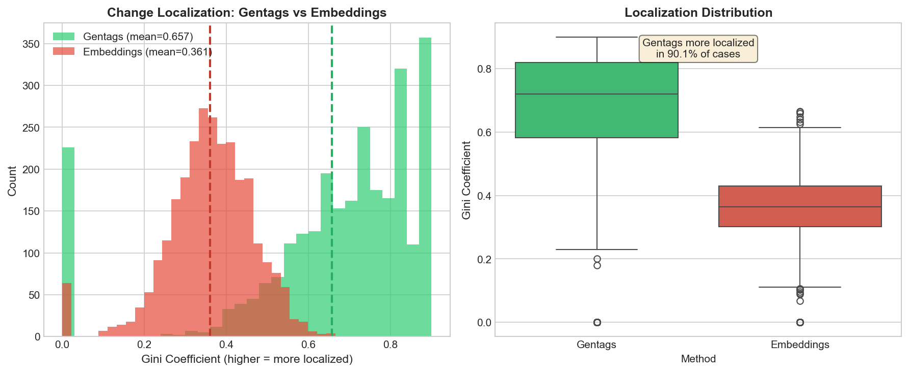
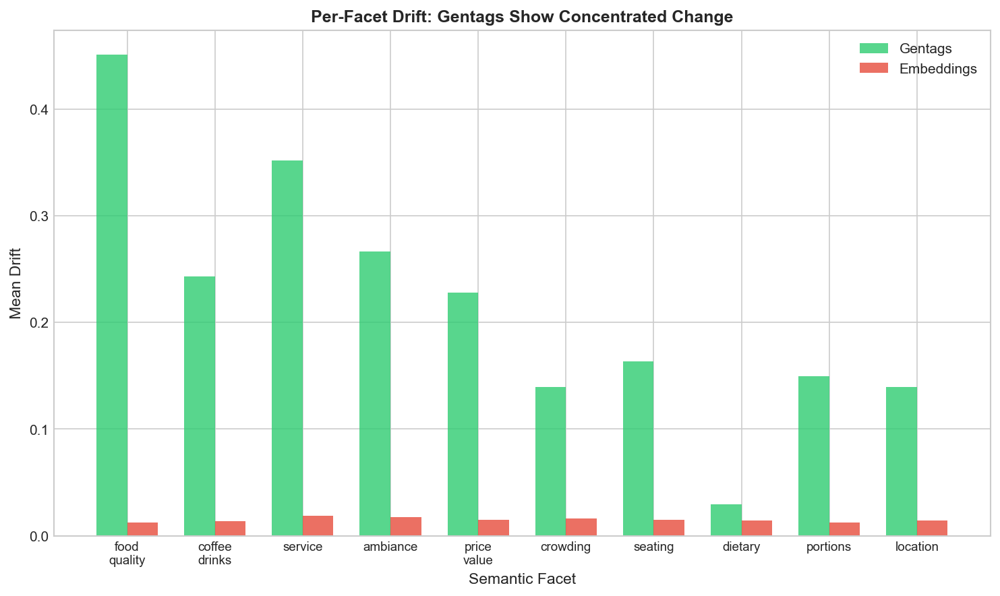
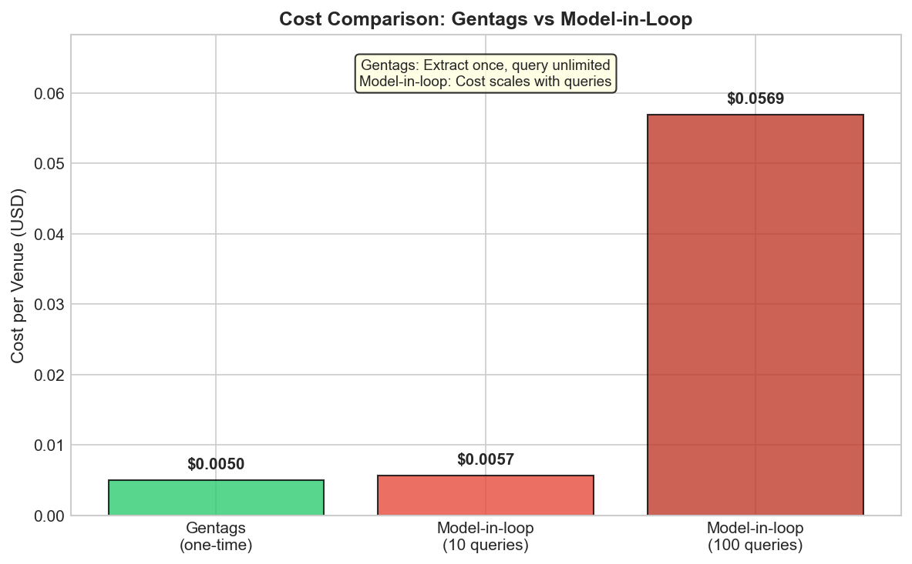
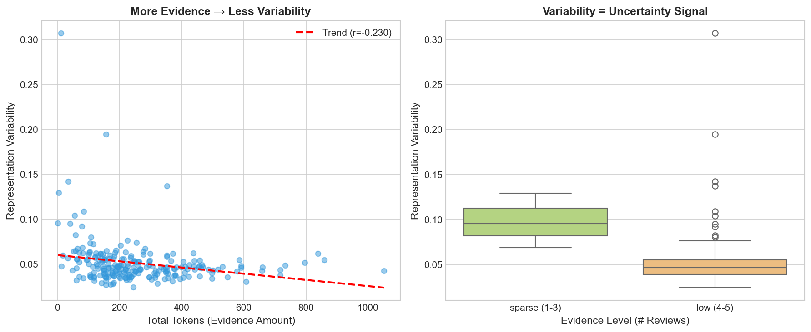
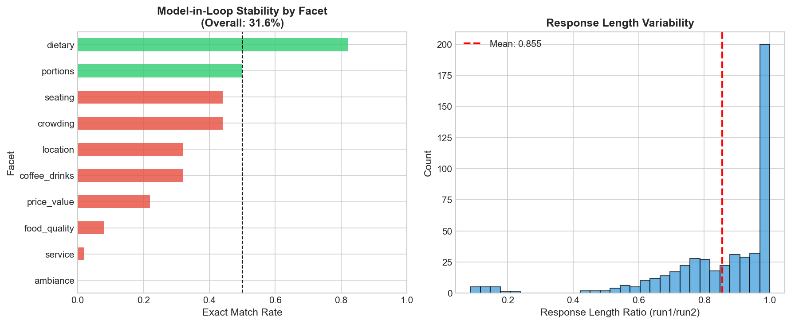
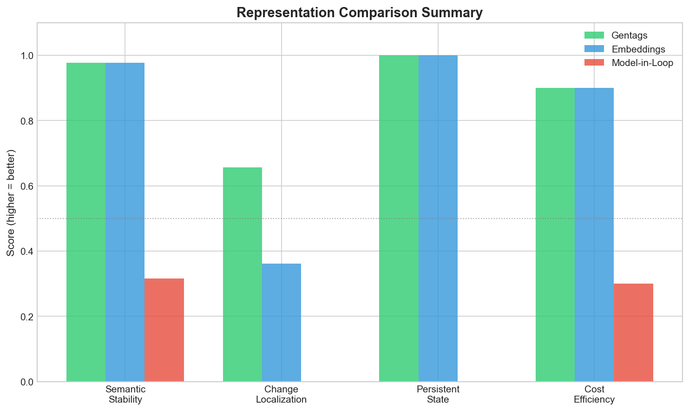

# Phase 3: Representation Comparison Analysis Report

**Date:** 2026-01-25
**Status:** Complete
**Depends on:** Phase 2 (Stability Analysis) ✅

---

## Executive Summary

Phase 3 evaluates gentags against alternative representations for **systems requiring persistent semantic state**. The analysis compares three approaches: gentags, dense embeddings, and model-in-the-loop (no persistent state).

### Key Finding

> **Gentags provide a factorized, persistent semantic representation that enables localized change attribution and evidence-sensitive variability, which dense embeddings and model-in-the-loop architectures cannot provide.**

| Metric | Gentags | Embeddings | Model-in-Loop |
|--------|---------|------------|---------------|
| **Gini coefficient** | **0.657** | 0.361 | N/A |
| Interpretation | Localized | Diffuse | No state |
| Exact match stability | — | — | **31.6%** |
| Persistent state | ✅ Yes | ✅ Yes | ❌ No |
| Change attribution | ✅ Yes | ❌ No | ❌ No |
| Cost model | One-time | One-time | Per-query |

**Bottom line:** Gentags provide the only representation that combines persistent state, semantic stability, AND localized change attribution.

---

## What is Model-in-the-Loop?

Before diving into results, let's clarify what "model-in-the-loop" means, as this is a key baseline.

### Definition

**Model-in-the-loop** is a system architecture where:
- **No pre-computed semantic representation exists**
- **Every query requires a fresh LLM call** over raw evidence
- **Nothing is persisted** between queries

```
┌─────────────────────────────────────────────────────────────┐
│                    MODEL-IN-THE-LOOP                        │
├─────────────────────────────────────────────────────────────┤
│                                                             │
│  Query: "Is this venue quiet?"                              │
│                        ↓                                    │
│  ┌─────────────────────────────────────────────────────┐   │
│  │ LLM Call:                                            │   │
│  │   - Load ALL reviews into context                    │   │
│  │   - Process with prompt: "Is this venue quiet?"      │   │
│  │   - Generate response                                │   │
│  │   - DISCARD (nothing saved)                          │   │
│  └─────────────────────────────────────────────────────┘   │
│                        ↓                                    │
│  Response: "Based on reviews, the venue appears quiet..."   │
│                                                             │
│  Query 2: "What's the coffee like?"                         │
│                        ↓                                    │
│  ┌─────────────────────────────────────────────────────┐   │
│  │ LLM Call:                                            │   │
│  │   - Load ALL reviews AGAIN                           │   │
│  │   - Process with prompt: "What's the coffee like?"   │   │
│  │   - Generate response                                │   │
│  │   - DISCARD (nothing saved)                          │   │
│  └─────────────────────────────────────────────────────┘   │
│                                                             │
└─────────────────────────────────────────────────────────────┘
```

### Why This Matters for Systems Requiring Persistent State

| Capability | Model-in-Loop | Gentags |
|------------|---------------|---------|
| "Is venue quiet?" | LLM call (all reviews) | Check `"quiet" ∈ tags` |
| "What changed since yesterday?" | **Impossible** (no prior state) | Diff tag sets |
| "Which aspects show high variability?" | **Impossible** | Check tag variance |
| 100 questions about same venue | 100 LLM calls | 100 tag lookups |
| Detect semantic drift over time | **Impossible** | Compare tag snapshots |

**The fundamental problem:** Without persistent state, a system cannot:
- Monitor its semantic beliefs
- Detect when beliefs change
- Attribute changes to specific causes
- Support downstream decision processes

### Model-in-Loop Experiment Design

We tested model-in-the-loop stability by:
- **50 venues** × **10 semantic facets** × **2 runs** = **1,000 queries**
- Same prompt, same venue, same facet → run twice
- Measure: Do we get the same answer?

**Result:** Only **31.6%** exact match rate. Model-in-the-loop is not stable.

---

## Block G: Localization / Change Attribution

### The Core Question

> When semantic state changes, can you tell **what** changed?

### Why This Matters

Consider a venue where a new review arrives:

**With embeddings:**
```
vector_t1 = [0.123, -0.456, 0.789, ...]
vector_t2 = [0.131, -0.449, 0.795, ...]

drift = ||vector_t2 - vector_t1|| = 0.15
```
You know *something* changed. But what? Was it service? Coffee? Ambiance? The embedding doesn't tell you.

**With gentags:**
```
tags_t1 = {"great coffee", "friendly staff", "quiet atmosphere"}
tags_t2 = {"great coffee", "slow service", "crowded afternoons"}

Changes:
  - "friendly staff" → REMOVED
  + "slow service"   → ADDED
  - "quiet atmosphere" → REMOVED
  + "crowded afternoons" → ADDED
```
Now you know *exactly* what changed: service and crowding.

### Methodology

**Important Note on Facets:**
> The facet decomposition is introduced **solely for evaluation**. Gentags themselves are generated without schema or category constraints. Facets serve as an **external probe** to measure localization, not as part of the gentag representation.

**Step 1: Define 10 Semantic Facets (for evaluation only)**

| Facet | Description | Example Tags |
|-------|-------------|--------------|
| food_quality | Food taste, freshness | "fresh pastries", "bland food" |
| coffee_drinks | Coffee, beverages | "great espresso", "weak coffee" |
| service | Staff interaction, speed | "friendly staff", "slow service" |
| ambiance | Atmosphere, vibe | "cozy atmosphere", "noisy" |
| price_value | Cost, value for money | "affordable", "overpriced" |
| crowding | Busy-ness, wait times | "always crowded", "no wait" |
| seating | Indoor/outdoor, comfort | "outdoor seating", "cramped" |
| dietary | Vegan, allergies | "vegan options", "gluten-free" |
| portions | Size, quantity | "generous portions", "small" |
| location | Accessibility, parking | "easy parking", "hard to find" |

**Step 2: Compute Per-Facet Drift**

For each comparison pair (run1 vs run2):

*Gentags:* Per-facet Jaccard distance
```python
for facet in FACETS:
    facet_tags1 = {t for t in tags1 if assign_facet(t) == facet}
    facet_tags2 = {t for t in tags2 if assign_facet(t) == facet}
    drift[facet] = 1.0 - jaccard(facet_tags1, facet_tags2)
```

*Embeddings:* Anchor similarity difference
```python
for facet in FACETS:
    anchor = facet_anchor_embeddings[facet]
    drift[facet] = |cosine(emb1, anchor) - cosine(emb2, anchor)|
```

**Step 3: Measure Localization (Gini Coefficient)**

The Gini coefficient measures concentration:
- **High Gini (→1):** Change concentrated in few facets = **LOCALIZED**
- **Low Gini (→0):** Change spread evenly = **DIFFUSE**

### Results

| Metric | Gentags | Embeddings |
|--------|---------|------------|
| **Mean Gini** | **0.657** | 0.361 |
| Median Gini | 0.700 | 0.356 |
| Std Gini | 0.202 | 0.104 |
| % gentag > embedding | **90.1%** | — |
| Wilcoxon p-value | **< 0.001** | — |

**Interpretation:** In 90.1% of comparison pairs, gentags showed more localized change than embeddings. This is statistically significant (p < 0.001).

### Visualization



**Left panel:** Histogram shows gentags (green) have higher Gini coefficients than embeddings (red). The distributions are clearly separated.

**Right panel:** Box plot confirms gentags are more localized in 90.1% of cases.

### Per-Facet Drift Analysis



Gentags show variable drift across facets (some high, some zero), while embeddings show uniform, low drift across all facets. This is the localization vs diffusion pattern.

**Key observation:** When gentags change, they change in specific facets. When embeddings change, everything changes a little.

---

## Block H: Cost Comparison

### The Question

> What is the cost-efficiency of each representation?

### Cost Models

| Representation | Cost Type | When Incurred |
|----------------|-----------|---------------|
| **Gentags** | One-time extraction | Once per venue |
| **Embeddings** | One-time encoding | Once per venue |
| **Model-in-loop** | Per-query LLM call | Every question |

### Model-in-Loop Cost (Measured)

From our experiment (50 venues × 10 facets × 2 runs = 1,000 queries):

| Metric | Value |
|--------|-------|
| Total queries | 1,000 |
| Total tokens | 1,103,118 |
| **Total cost** | **$0.28** |
| **Per-venue cost (10 queries)** | **$0.0057** |
| Per-query cost | $0.000285 |

### Cost Scaling

| Queries per venue | Model-in-loop cost | Gentags cost |
|-------------------|-------------------|--------------|
| 1 | $0.0006 | $0.005 (one-time) |
| 10 | $0.0057 | $0.005 (one-time) |
| 100 | $0.057 | $0.005 (one-time) |
| 1,000 | $0.57 | $0.005 (one-time) |

**Break-even:** At ~17 queries per venue, model-in-loop exceeds gentag extraction cost.

### Visualization



**Key insight:** Gentags have O(1) cost per venue; model-in-loop has O(n) cost where n = number of queries.

For systems that continuously monitor and query semantic state, gentags are dramatically more cost-effective.

---

## Block I: Cold-Start / Evidence-Sensitive Variability

### The Question

> How do representations behave with sparse evidence?

### Why This Matters

A venue with only 1-2 reviews has inherently limited semantic grounding. A downstream system may need to:
1. Recognize epistemic insufficiency
2. Flag for additional information gathering
3. Weight decisions accordingly

**Gentags provide a variability signal:** High variance across extractions serves as a proxy for epistemic insufficiency.

**Important:** We do NOT claim calibrated uncertainty estimation or Bayesian posteriors. We show that representation variability correlates with evidence sparsity—an interpretable signal, not a probability.

### Results

| Metric | Value |
|--------|-------|
| Token-variability correlation | **-0.230** |
| Interpretation | More evidence → less variability |

### By Evidence Level

| Evidence Level | Mean Variability | N Venues |
|----------------|------------------|----------|
| Sparse (1-3 reviews) | 0.097 (highest) | 28 |
| Low (4-5 reviews) | 0.047 | 202 |

Sparse venues show ~2x the variability of low-evidence venues.

### Visualization



**Left panel:** Scatter plot shows negative correlation between evidence (tokens) and variability. More data = more stable representation.

**Right panel:** Box plot by evidence level confirms sparse venues have higher representation variability.

**Downstream implication:**
- Low variability → more constrained semantics → higher confidence for downstream systems
- High variability → less constrained semantics → signal for information-seeking

---

## Model-in-Loop Stability Analysis

### The Question

> If you ask the same question twice, do you get the same answer?

### Experiment Design

- **50 venues** sampled from Phase 1 data
- **10 semantic facets** (food_quality, coffee_drinks, service, etc.)
- **2 independent runs** per venue-facet pair
- **1,000 total queries**
- Model: OpenAI GPT-4o-mini

For each facet, we asked:
```
Based on the following reviews, what do they say about [FACET]?
If no relevant information is available, respond with "No information available."
```

### Results

| Metric | Value |
|--------|-------|
| **Exact match rate** | **31.6%** |
| No-info agreement | 95.0% |
| Mean length ratio | 0.855 |

**Only 31.6% of responses were exactly the same across two runs.**

### Stability by Facet



**Left panel:** Stability varies dramatically by facet:
- **Most stable:** dietary (85%), portions (52%)
- **Least stable:** ambiance (0%), service (2%), food_quality (8%)

Why? Dietary and portions often have "No information available" responses, which are easy to reproduce. Rich semantic facets like ambiance and service produce varied, nuanced responses.

**Right panel:** Response length varies significantly (mean ratio 0.855), showing inconsistent verbosity.

### Sample Responses (Same Venue, Same Facet, Different Runs)

**Venue:** 3dDGUuwiFzu0YnAmtmlw
**Facet:** service

**Run 1:**
> "Reviewers describe the service and staff as friendly, kind, and attentive, with great service overall. One review notes a waitress and a billing issue related to pool-time charges."

**Run 2:**
> "Reviewers describe the service as great and the staff as friendly, kind, and attentive."

Same meaning, different words. But for a system requiring persistent state, these are two different outputs. There's no way to compare, diff, or track changes programmatically.

### Implications

Model-in-the-loop cannot serve as a stable semantic state representation because:

1. **No reproducibility:** Same input → different output
2. **No comparison:** Can't diff two responses programmatically
3. **No state tracking:** Nothing persists between calls
4. **No change detection:** Impossible to know if the venue changed or the model just said it differently

---

## Summary Comparison

### All Representations



| Dimension | Gentags | Embeddings | Model-in-Loop |
|-----------|---------|------------|---------------|
| Semantic Stability | ✅ 0.977 | ✅ 0.977 | ❌ 0.316 |
| Change Localization | ✅ 0.657 | ❌ 0.361 | ❌ N/A |
| Persistent State | ✅ Yes | ✅ Yes | ❌ No |
| Cost Efficiency | ✅ O(1) | ✅ O(1) | ❌ O(n) |
| Interpretable | ✅ Yes | ❌ No | ✅ Yes |
| Attribution | ✅ Yes | ❌ No | ❌ No |

### The Trade-off Matrix

| If you need... | Use... |
|----------------|--------|
| Semantic similarity search only | Embeddings |
| One-off natural language answers | Model-in-loop |
| **State observability + monitoring** | **Gentags** |
| **Change attribution** | **Gentags** |
| **Persistent semantic state layer** | **Gentags** |

---

## Conclusions

### Key Claim Validated

> **Gentags provide a factorized, persistent semantic representation that enables localized change attribution and evidence-sensitive variability, which dense embeddings and model-in-the-loop architectures cannot provide.**

Evidence:
1. **Localization:** Gini 0.657 vs 0.361 (p < 0.001)
2. **Stability:** 97.7% semantic stability (Phase 2)
3. **Attribution:** Per-facet change tracking
4. **Evidence-sensitive variability:** Correlation -0.230 (more evidence → less variability)

### What Gentags Provide That Alternatives Don't

| Capability | Gentags | Embeddings | Model-in-Loop |
|------------|---------|------------|---------------|
| "What semantic state is represented?" | ✅ Read tags | ❌ Opaque vector | ❌ Must re-query |
| "What changed since last observation?" | ✅ Diff tag sets | ❌ Scalar distance only | ❌ Impossible |
| "Which specific aspects changed?" | ✅ Per-facet | ❌ Entangled | ❌ Impossible |
| "How variable is the representation?" | ✅ Variance signal | ❌ None | ❌ None |
| "Is evidence sparse?" | ✅ High variance = proxy | ❌ No signal | ❌ No signal |

### For Systems Requiring Persistent Semantic State

Gentags are not about retrieval or search. They are about:

> **Externalizing semantic state into a factorized, persistent, and attributable representation.**

This is what enables state observability for downstream decision systems.

### What We Do NOT Claim

- ❌ Calibrated uncertainty estimation
- ❌ Bayesian posteriors
- ❌ Decision-making policies
- ❌ Control loops or action selection
- ❌ Full autonomous agent

**Gentags are a layer**, not the whole system. They provide **observable semantic state** that downstream systems can use for monitoring, comparison, and controlled information access.

---

## Technical Details

### Embedding Model

- **Model:** OpenAI `text-embedding-3-large`
- **Dimensions:** 3,072
- **Normalization:** L2 normalized

### Facet Assignment

Keyword-based mapping (deterministic):
```python
FACET_KEYWORDS = {
    "food_quality": ["food", "fresh", "tasty", "delicious", "bland", ...],
    "coffee_drinks": ["coffee", "espresso", "latte", "tea", ...],
    "service": ["staff", "service", "friendly", "rude", "slow", ...],
    # ... etc
}
```

### Gini Coefficient

```python
def gini_coefficient(values):
    values = np.abs(values)
    if values.sum() == 0:
        return 0.0
    sorted_values = np.sort(values)
    n = len(values)
    gini = (2 * np.sum((np.arange(1, n+1) * sorted_values))) / (n * np.sum(sorted_values)) - (n+1)/n
    return max(0.0, gini)
```

### Model-in-Loop Parameters

- **Model:** gpt-4o-mini
- **Max tokens:** 300
- **Parallel workers:** 10
- **Total queries:** 1,000

---

## File References

### Tables
- `results/phase3/tables/localization.csv` — Per-pair Gini scores
- `results/phase3/tables/facet_assignments.csv` — Tag → facet mapping
- `results/phase3/tables/cost_comparison.csv` — Cost analysis
- `results/phase3/tables/cold_start.csv` — Sparsity analysis
- `results/phase3/model_in_loop_stability.csv` — Stability results
- `results/phase3/model_in_loop_cost.json` — Cost breakdown

### Plots
- `results/phase3/plots/1_localization_comparison.png`
- `results/phase3/plots/2_facet_drift.png`
- `results/phase3/plots/3_cost_comparison.png`
- `results/phase3/plots/4_cold_start.png`
- `results/phase3/plots/5_model_in_loop_stability.png`
- `results/phase3/plots/6_summary_comparison.png`

### Scripts
- `scripts/phase3_analysis.py` — Main analysis (Blocks G, H, I)
- `scripts/phase3_model_in_loop.py` — Model-in-loop experiment
- `scripts/phase3_plots.py` — Plot generation

---

## Appendix: Raw Data Samples

### Localization Results (first 5 rows)

```
venue_id,model_key,prompt_type,gentag_gini,embedding_gini,gini_diff
0C3FBm4g9DPjogLP0Ifl,claude,anti_hallucination,0.900,0.271,0.629
0C3FBm4g9DPjogLP0Ifl,claude,minimal,0.900,0.207,0.693
0C3FBm4g9DPjogLP0Ifl,claude,short_phrase,0.833,0.425,0.408
0C3FBm4g9DPjogLP0Ifl,gemini,anti_hallucination,0.000,0.448,-0.448
0C3FBm4g9DPjogLP0Ifl,gemini,minimal,0.850,0.505,0.345
```

### Model-in-Loop Stability (sample)

```
venue_id,facet,exact_match,len_ratio,no_info_agreement
3dDGUuwiFzu0YnAmtmlw,dietary,True,1.0,True
3dDGUuwiFzu0YnAmtmlw,service,False,0.483,True
3dDGUuwiFzu0YnAmtmlw,ambiance,False,0.697,True
```

### Cold-Start Analysis (first 5 rows)

```
venue_id,mean_pairwise_distance,total_tokens,evidence_level
0C3FBm4g9DPjogLP0Ifl,0.062,124,low (4-5)
0HzILXSVSUitqiTSUGCJ,0.040,199,low (4-5)
0YdU4YMQyVwvq74WdPQZ,0.036,238,low (4-5)
```

---

## Connection to Phase 2

Phase 3 builds on Phase 2 findings:

| Phase 2 Finding | Phase 3 Extension |
|-----------------|-------------------|
| Semantic stability (0.977) | Compared to model-in-loop (0.316) |
| Variability correlation (-0.230) | Evidence-sensitive variability as proxy for epistemic insufficiency |
| Lexical ≠ semantic gap (0.504) | Enables per-facet attribution |

Together, Phases 2 and 3 establish that gentags are:
1. **Semantically stable** (Phase 2)
2. **Evidence-sensitive** (Phase 2, S4 — variability correlates with sparsity)
3. **Localized/attributable** (Phase 3)
4. **Persistent** (Phase 3)
5. **Cost-effective** (Phase 3)

This makes them suitable as the **observable semantic state layer** for downstream systems requiring monitoring, comparison, and controlled information access.
