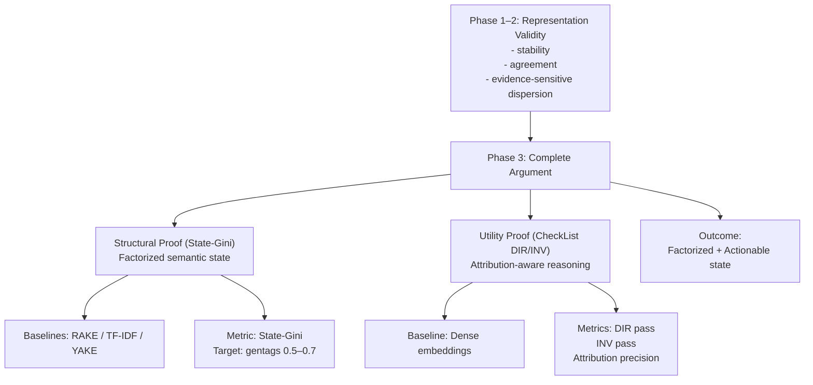

# Phase 3 Utility Proof — Infographic (Mermaid)

```mermaid
flowchart TD
  A["Phase 1–2: Representation Validity\n- stability\n- agreement\n- evidence-sensitive dispersion"] --> B["Phase 3: Complete Argument"]

  B --> C["Structural Proof (State-Gini)\nFactorized semantic state"]
  C --> C1["Baselines: RAKE / TF-IDF / YAKE"]
  C --> C2["Metric: State-Gini\nTarget: gentags 0.5–0.7"]

  B --> D["Utility Proof (CheckList DIR/INV)\nAttribution-aware reasoning"]
  D --> D1["Baseline: Dense embeddings"]
  D --> D2["Metrics: DIR pass\nINV pass\nAttribution precision"]

  B --> E["Outcome:\nFactorized + Actionable state"]
```
