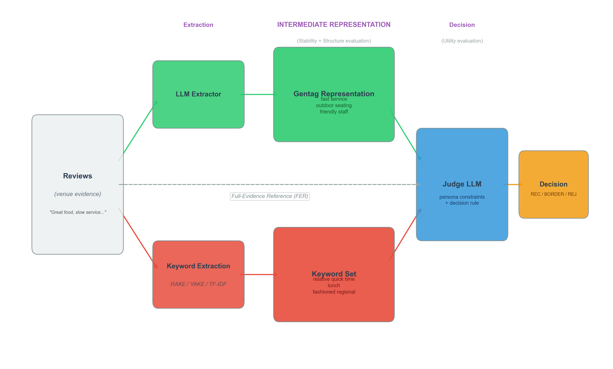

# Section 3: Gentags

> **Paper section:** Section 3
> **Status:** Draft
> **Last updated:** 2026-03-07

---

## 3.1 Definition

A **gentag** is a short, evidence-conditioned semantic unit extracted from natural language text by a large language model. Gentags are not drawn from a predefined ontology or label set; they are generated freely by the model in response to the source text.

Empirically, gentags fall into three categories: **descriptive attributes** (60.0%; e.g., "outdoor seating", "live music"), **evaluative propositions** (24.5%; e.g., "slow service", "amazing food"), and **entity mentions** (11.4%; e.g., "brisket", "margarita"), with a small mixed category (4.1%; e.g., "delicious pizza"). The modal form is a two-word phrase (76.8%). Each unit contributes to the semantic state of the represented entity: evaluative propositions assert quality judgments, descriptive attributes assert characteristics, and entity mentions assert presence.

Gentags are not an ontology, a belief model, or a retrieval index. They are a structural proposal for externalized semantic state in LLM decision pipelines. Figure 1 shows the experimental pipeline: reviews are converted into alternative intermediate representations (Gentags or lexical keyword sets), and a judge LLM applies persona constraints to produce decisions.

---

## 3.2 Extraction

Gentags are produced by prompting a large language model with textual evidence and requesting short, grounded semantic tags. No label set, ontology, or examples are provided. The model generates tags freely, conditioned only on the input text.

Given textual evidence $E$ (a set of reviews or narrative documents about an entity), extraction produces a gentag state:

$$S = f_\theta(E)$$

where $f_\theta$ is an LLM parameterized by $\theta$. The output $S = \{g_1, g_2, \ldots, g_n\}$ is an unordered set of gentags. The number of tags $n$ is not fixed; it is determined by the model based on the evidence.

The extraction prompt instructs the model to:
1. Read the provided evidence
2. Produce short semantic phrases (1--4 words) grounded in the text
3. Return only a JSON list of tags

Three prompt variants are used (minimal, anti-hallucination, short-phrase), varying in how strongly they constrain grounding and brevity. All three produce semantically convergent output despite surface variation (cross-prompt cosine similarity > 0.95; see Section 4).

Four LLMs are used as extractors (GPT-5-nano, Gemini 2.5-flash, Claude Sonnet 4.5, Grok-4). Cross-model semantic agreement exceeds 0.94 cosine similarity, indicating that the extracted state reflects the evidence rather than model-specific biases.

Tags exceeding 4 words are filtered post-hoc. No other filtering, ranking, or selection is applied. The extraction is zero-shot: no task-specific fine-tuning or in-context examples are used.

---

## 3.3 State Representation

The gentag state of an entity is a finite set of discrete semantic units:

$$S = \{g_1, g_2, \ldots, g_n\}$$

where each $g_i$ is a short natural-language string. This set constitutes an explicit, addressable semantic state abstraction. Unlike dense embeddings, which encode meaning in continuous vectors, and unlike raw text, which embeds meaning in unstructured narrative, the gentag state exposes its semantic content as individually readable, comparable, and editable units.

The state supports four operations relevant to constraint-sensitive decision pipelines:

- **Inspection.** Each $g_i$ is a readable string. A human or automated system can enumerate the state and understand what it represents without decoding or projection.

- **Comparison.** Two states $S_A$ and $S_B$ can be compared at the level of individual units. Differences between entities are localized to specific tags rather than distributed across an opaque vector.

- **Editing.** Individual tags can be added, removed, or replaced. This enables controlled interventions: to test whether a specific semantic property affects a downstream decision, one edits the corresponding tag without altering the rest of the state.

- **Constraint evaluation.** Decision rules can reference specific tags or tag patterns. A constraint such as "reject if no fast-service indicator is present" can be evaluated directly against the state, because the relevant information is expressed as discrete, matchable units.

---

## 3.4 Representation Properties

The gentag representation has five properties that distinguish it from alternative text-derived representations.

**Discrete.** Each gentag is a separable unit. The state is a set of bounded strings, not a continuous vector or an unstructured paragraph. Operations over the state (comparison, editing, rule evaluation) apply to individual units.

**Schema-free.** Gentags are not drawn from a predefined taxonomy, ontology, or label set. The vocabulary emerges from the evidence and the model's language capacity. This avoids the coverage limitations of fixed schemas while preserving semantic structure.

**Externalized.** The state is stored outside the model as persistent data. It is not recomputed on each query and does not depend on the model's context window. Once extracted, the state can be cached, versioned, and transmitted independently of the extraction model.

**Evidence-conditioned.** Each tag is grounded in the provided source text. The extraction prompt explicitly constrains the model to produce only tags supported by the evidence. This distinguishes gentags from model-generated summaries or completions, which may introduce information not present in the input.

**Inspectable.** The state is composed of natural-language strings readable by humans. Unlike dense embeddings, which require projection or probing to interpret, gentag state is directly legible. This supports auditing, debugging, and manual verification of downstream decisions.
