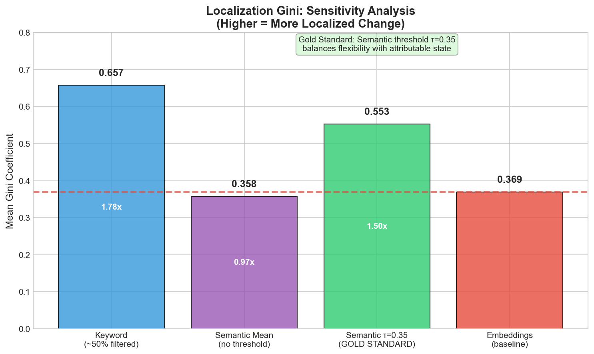
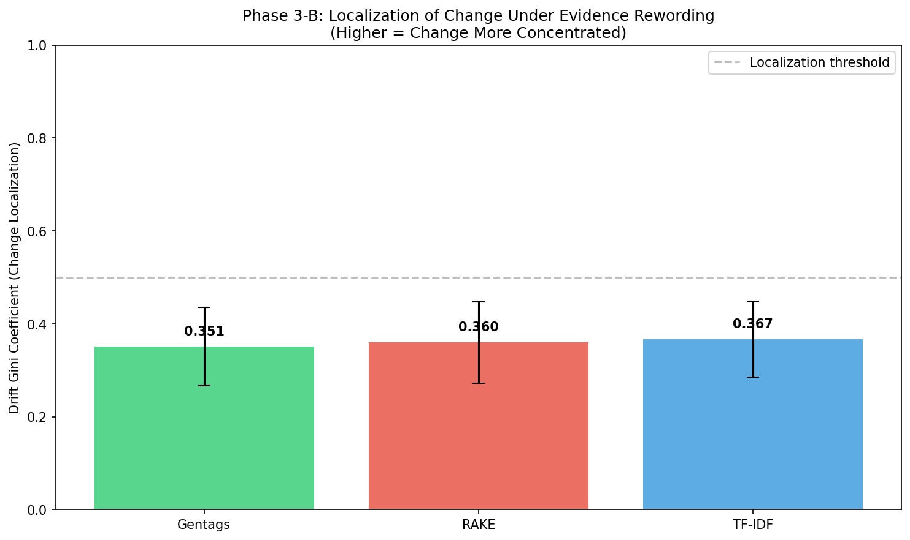
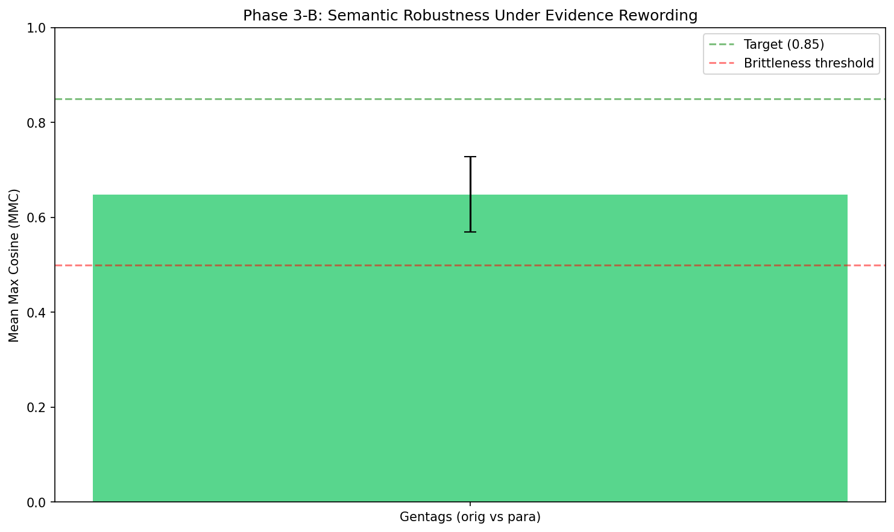
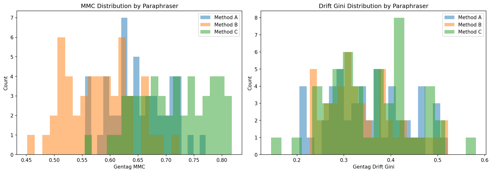

# Section 5: Analysis / Results

> **Paper section:** Section 5
> **Status:** Draft — comprehensive with all metrics, plots, and tables
> **Last updated:** 2026-03-19
> **Source discipline:** All numeric claims checked against `results/` artifacts and phase-specific reports. Plot paths verified against `results/phase2/plots/`, `results/phase3/plots/`, `results/phase3b/plots/`.

---

## 5. Analysis / Results

The empirical results are organized around three claims. First, gentags must be recoverable across repeated extractions, prompts, and extractor models (stability). Second, they must exhibit useful structural organization relative to lexical baselines (structure). Third, that structure must improve downstream constrained decisions (decision utility).

The studies proceed in three layers. **Phase 2** evaluates representation stability. **Phase 3** evaluates structural organization through facet coverage and State-Gini. **Phase 5** evaluates downstream decision utility under explicit hard constraints. **Phase 4** provides supporting mechanistic evidence via directional interventions.

---

## 5.1 Stability Analysis

The stability results establish whether gentags behave like a recoverable semantic state rather than a brittle surface artifact. The core empirical pattern across all stability tests: wording changes substantially, but meaning remains highly stable.

**Extraction grid:** 13,272 extractions from 553 venues × 4 extractor models × 3 prompt variants × 2 runs. After filtering extraction failures, the analysis uses **230 venues** with successful extractions from all four models, yielding **5,517 final extractions** and **118,832 tag rows**.

### 5.1.1 Run-to-run Stability

Repeated extractions under the same model and prompt recover nearly the same semantic content despite substantial lexical variation.

| Metric | Median | Q1 | Q3 |
|--------|--------|----|----|
| Semantic cosine | **0.977** | 0.968 | 0.986 |
| Surface Jaccard | **0.471** | 0.333 | 0.625 |
| MMC paraphrase consistency | **0.887** | 0.839 | 0.927 |
| Semantic-surface gap | **0.504** | — | — |

The gap between cosine and Jaccard (0.504) shows that variation lies in paraphrase and lexical choice rather than semantic drift. This is visible by model:

| Model | Cosine | Jaccard | MMC |
|-------|--------|---------|-----|
| Claude | 0.982 | 0.574 | 0.913 |
| Gemini | 0.971 | 0.404 | 0.869 |
| Grok | 0.975 | 0.722 | 0.876 |
| OpenAI | 0.975 | 0.387 | 0.861 |

All four models remain in the same regime: high semantic similarity, clearly lower lexical overlap. Claude and Grok produce higher surface overlap; Gemini and OpenAI show more paraphrastic variation.

**Detailed by model and prompt:**

| Model | Prompt | Cosine | Jaccard | MMC |
|-------|--------|--------|---------|-----|
| claude | anti_hallucination | 0.988 | 0.645 | 0.936 |
| claude | minimal | 0.981 | 0.558 | 0.906 |
| claude | short_phrase | 0.978 | 0.519 | 0.897 |
| gemini | anti_hallucination | 0.978 | 0.440 | 0.888 |
| gemini | minimal | 0.972 | 0.393 | 0.867 |
| gemini | short_phrase | 0.964 | 0.379 | 0.851 |
| grok | anti_hallucination | 0.985 | 0.800 | 0.910 |
| grok | minimal | 0.970 | 0.667 | 0.865 |
| grok | short_phrase | 0.969 | 0.700 | 0.853 |
| openai | anti_hallucination | 0.980 | 0.455 | 0.880 |
| openai | minimal | 0.974 | 0.364 | 0.855 |
| openai | short_phrase | 0.972 | 0.341 | 0.847 |

**Plot:** Violin/ECDF of cosine similarity across runs

**Plot:** Surface vs semantic scatter — demonstrates decoupling of lexical overlap from semantic similarity

**Data source:** `results/phase2/tables/run_stability.csv`, `results/phase2/tables/run_stability_summary.csv`

---

### 5.1.2 Prompt Sensitivity

Prompt wording changes the resolution and style of the recovered state, but not the core semantic content.

| Prompt Pair | Mean Cosine | Mean Jaccard |
|-------------|-------------|--------------|
| anti_hallucination ↔ minimal | **0.966** | 0.321 |
| anti_hallucination ↔ short_phrase | **0.962** | 0.282 |
| minimal ↔ short_phrase | **0.966** | 0.352 |

**Prompt characteristics:**

| Prompt | Behavior |
|--------|----------|
| `anti_hallucination` | More tags, higher granularity, more grounded |
| `minimal` | Moderate tags, balanced |
| `short_phrase` | Fewer tags, more compressed |

Cross-prompt cosine remains above 0.95 throughout, confirming that prompt changes alter surface form and granularity but the same underlying venue semantics remain recoverable.

**Detailed by model and prompt pair:**

| Model | Prompt 1 | Prompt 2 | Cosine | Jaccard |
|-------|----------|----------|--------|---------|
| claude | anti_hallucination | minimal | 0.962 | 0.370 |
| claude | anti_hallucination | short_phrase | 0.960 | 0.333 |
| claude | minimal | short_phrase | 0.965 | 0.373 |
| gemini | anti_hallucination | minimal | 0.961 | 0.304 |
| gemini | anti_hallucination | short_phrase | 0.949 | 0.241 |
| gemini | minimal | short_phrase | 0.957 | 0.293 |
| grok | anti_hallucination | minimal | 0.972 | 0.375 |
| grok | anti_hallucination | short_phrase | 0.971 | 0.350 |
| grok | minimal | short_phrase | 0.972 | 0.419 |
| openai | anti_hallucination | minimal | 0.969 | 0.333 |
| openai | anti_hallucination | short_phrase | 0.967 | 0.303 |
| openai | minimal | short_phrase | 0.969 | 0.323 |

**Plot:** Heatmap of prompt effects on semantic state

**Data source:** `results/phase2/tables/prompt_sensitivity.csv`, `results/phase2/tables/prompt_sensitivity_summary.csv`

---

### 5.1.3 Cross-model Agreement

The strongest recoverability test. If multiple extractor models recover closely aligned gentag states from the same evidence, the representation is harder to dismiss as a model-specific artifact.

| Model Pair | Mean Cosine | Mean Jaccard |
|------------|-------------|--------------|
| Claude ↔ Gemini | 0.951 | 0.253 |
| Claude ↔ Grok | 0.953 | 0.267 |
| Claude ↔ OpenAI | 0.951 | 0.236 |
| Gemini ↔ Grok | 0.969 | 0.323 |
| Gemini ↔ OpenAI | 0.958 | 0.248 |
| Grok ↔ OpenAI | 0.969 | 0.315 |

All pairwise semantic similarities exceed **0.94**, while lexical overlap remains much lower (0.20–0.36). The evidence constrains a shared semantic state while leaving freedom in phrasing and packaging.

**Detailed by prompt:**

| Prompt | Model 1 | Model 2 | Cosine | Jaccard |
|--------|---------|---------|--------|---------|
| anti_hallucination | claude | gemini | 0.955 | 0.269 |
| anti_hallucination | claude | grok | 0.954 | 0.283 |
| anti_hallucination | claude | openai | 0.954 | 0.267 |
| anti_hallucination | gemini | grok | 0.972 | 0.346 |
| anti_hallucination | gemini | openai | 0.963 | 0.274 |
| anti_hallucination | grok | openai | 0.974 | 0.357 |
| minimal | claude | gemini | 0.948 | 0.236 |
| minimal | claude | grok | 0.952 | 0.250 |
| minimal | claude | openai | 0.947 | 0.204 |
| minimal | gemini | grok | 0.965 | 0.300 |
| minimal | gemini | openai | 0.953 | 0.222 |
| minimal | grok | openai | 0.963 | 0.273 |

**Plot:** Heatmap of model agreement cross-validation

**Data source:** `results/phase2/tables/model_sensitivity.csv`, `results/phase2/tables/model_sensitivity_summary.csv`

---

### 5.1.4 Evidence-induced Dispersion

Sparse evidence produces less identifiable states and greater dispersion. The correlation between evidence quantity and representation dispersion is **r = -0.230**.

| Token Bucket | Mean Variability | N Venues |
|--------------|------------------|----------|
| <200 | **0.0568** (highest) | 104 |
| 200–400 | 0.0465 | 87 |
| 400–600 | 0.0454 | 29 |
| 600–1000 | 0.0462 | 9 |
| >1000 | **0.0424** (lowest) | 1 |

**Variability definition:** Mean pairwise distance (1 − cosine) among the 24 tag embeddings per venue (4 models × 3 prompts × 2 runs). This measures **semantic identifiability** — how strongly the evidence constrains the recovered state — not just aleatoric model noise.

**Concrete examples:**

| Venue | Evidence (tokens) | Mean Pairwise Distance | Interpretation |
|-------|-------------------|------------------------|----------------|
| KzvuSntI35Z638fGoOJ4 | 12 | 0.307 | Sparse → high dispersion |
| GVn2q90PoVQ5p6EcJb4W | 5 | 0.129 | Very sparse but simple → moderate |
| KpUCiPXVvQRWMFJACn0I | 1,051 | 0.042 | Dense → low dispersion |

Dispersion tracks how strongly the evidence constrains the semantic state. Under sparse evidence, multiple plausible gentag states can be recovered; under richer evidence, the state becomes more identifiable.

**Plot:** Evidence-induced dispersion correlation

**Data source:** `results/phase2/tables/sparsity_analysis.csv`, `results/phase2/tables/uncertainty_dispersion.csv`

---

### 5.1.5 Retention Analysis (Supporting)

Gentags retain source review meaning significantly better than random baselines.

| Metric | Value |
|--------|-------|
| Retention (cosine to reviews) | **0.625** |
| Random baseline | 0.461 |
| Delta (above random) | **+0.164** |

**Plot:** Retention by model and prompt

**Plot:** Cost-effectiveness Pareto front

**Data source:** `results/phase2/tables/retention.csv`, `results/phase2/tables/compression_summary.csv`

---

### Phase 2 Summary

Gentags are recoverable enough to function as an externalized semantic state. They are not lexically fixed, but semantically stable across reruns (cosine 0.977), prompts (>0.95), and extractor models (>0.94). Dispersion tracks evidence sparsity (r = -0.230), making it an identifiability signal rather than arbitrary noise.

---

## 5.2 Structural Analysis

The structural analysis asks what kind of semantic state gentags form and whether they organize content more usefully than lexical baselines.

**Methodology:** Tags/keywords are projected into a shared 10-facet diagnostic space using frozen anchor embeddings from `text-embedding-3-large` and hard assignment with threshold τ = 0.35. Items below threshold go to an explicit `other` bucket. State-Gini is computed on the 10 facet counts (excluding `other`).

**10 diagnostic facets:** Food quality, Service, Ambiance, Value, Location, Cleanliness, Menu variety, Entertainment, Wait time, Accessibility.

**Analysis scope:** 10,373 gentag extractions (553 venues); 230 aligned venues for baseline comparison (RAKE, TF-IDF, YAKE).

---

### 5.2.1 Facet Coverage

Facet coverage is measured through the fraction of semantic units routed to `other`. Lower `other_rate` = more semantic mass captured by the facet inventory.

| Method | Tags/keywords per unit (mean) | Assigned (mean) | Other (mean) | Other rate |
|--------|-------------------------------|-----------------|--------------|------------|
| **Gentags** | 21.9 | 12.3 | 9.6 | **~43%** |
| RAKE | 19.5 | 6.1 | 13.3 | **~68%** |
| TF-IDF | 19.8 | 6.6 | 13.2 | **~67%** |
| YAKE | 19.8 | 6.5 | 13.3 | **~67%** |

Gentags place roughly twice as many units into the diagnostic facet space as lexical baselines (~12 vs ~6). Baselines leave ~67% of their mass below threshold — too noisy, local, or semantically incomplete to survive thresholding.

**Venue-aggregated (like-for-like, 230 venues):**

| Method | State-Gini (mean) | Other rate (mean) |
|--------|-------------------|-------------------|
| Gentags (venue-level) | 0.573 | 42.8% |
| RAKE | 0.701 | 68.1% |
| TF-IDF | 0.715 | 66.7% |
| YAKE | 0.738 | 67.1% |

The like-for-like comparison confirms the pattern is not an artifact of per-extraction vs per-venue aggregation.

**Plot:** Baseline vs gentag facet coverage

**Plot:** Summary comparison across methods

**Data source:** `results/phase3/tables/state_localization.csv`, `results/phase3a/tables/baseline_state_gini.csv`, `results/phase3/tables/venue_gentag_state_gini.csv`

---

### 5.2.2 State-Gini

State-Gini measures concentration of **assigned** semantic mass across the 10 facets. High Gini = mass in few facets; low Gini = mass spread more evenly.

| Method | Mean State-Gini | Std. Dev. | n |
|--------|-----------------|-----------|---|
| **Gentags** | **0.600** | 0.127 | 10,373 extractions |
| RAKE | 0.701 | 0.140 | 230 venues |
| TF-IDF | 0.715 | 0.116 | 230 venues |
| YAKE | 0.738 | 0.150 | 230 venues |

**Critical interpretation:** Baselines show *higher* Gini, but this is partly an artifact of low coverage. With ~67% in `other`, only ~6 keywords survive threshold — and with 6 items across 10 bins, the distribution is inevitably spiky.

**The right joint interpretation:**

| | Gentags | Baselines |
|---|---------|-----------|
| Other rate | ~43% (better coverage) | ~67% (worse coverage) |
| State-Gini | 0.600 (more balanced) | 0.70–0.74 (spikier) |
| Interpretation | Broader, balanced semantic state | Spiky partial coverage |

Gentags capture more semantic mass inside the facet inventory and distribute it across more decision-relevant dimensions. Baselines leave most mass outside the measured space and concentrate what remains in a few surviving facets.

**Bleed check (cross-facet similarity):** For 5,000 sampled gentags:

| Metric | Value |
|--------|-------|
| Gap (primary − secondary facet) mean | 0.065 |
| Gap median | 0.039 |
| % near-miss (gap < 0.05) | 57.4% |
| % clear primary (gap ≥ 0.10) | 20.5% |

57% of tags sit between two facets — facet boundaries are soft for a substantial share, but the hard-assignment procedure still produces a clean structural signal.

**Data source:** `results/phase3a/tables/state_gini_summary.csv`, `results/phase3/bleed_check_summary.json`

---

### 5.2.3 Threshold Sensitivity

The facet-assignment procedure was rerun at τ ∈ {0.30, 0.35, 0.40} to test robustness.

| τ | Method | State-Gini | Other rate (%) |
|---|--------|------------|----------------|
| 0.30 | **Gentags** | 0.575 | **26.6** |
| 0.30 | RAKE | 0.647 | 50.9 |
| 0.30 | TF-IDF | 0.689 | 50.5 |
| 0.30 | YAKE | 0.710 | 50.2 |
| 0.35 | **Gentags** | 0.600 | **42.6** |
| 0.35 | RAKE | 0.701 | 68.1 |
| 0.35 | TF-IDF | 0.715 | 66.7 |
| 0.35 | YAKE | 0.738 | 67.1 |
| 0.40 | **Gentags** | 0.630 | **55.1** |
| 0.40 | RAKE | 0.733 | 78.0 |
| 0.40 | TF-IDF | 0.774 | 80.2 |
| 0.40 | YAKE | 0.770 | 79.6 |

At every threshold, gentags retain more mass within the facet inventory. At τ = 0.30, gentags assign ~73% vs baselines ~50%. At τ = 0.40, baselines lose ~80% to `other` while gentags retain ~45%. The coverage gap is robust across threshold choices.

**Plot:** Tau sensitivity sweep visualization

**Data source:** `results/phase3/tables/state_localization_tau030.csv`, `results/phase3/tables/state_localization_tau040.csv`, `results/phase3a/tables/baseline_state_gini_tau030.csv`, `results/phase3a/tables/baseline_state_gini_tau040.csv`

---

### 5.2.4 Paraphrase Robustness (Supporting)

Phase 3B tested whether the structural results are robust to paraphrase of the source reviews. Three paraphrase methods (GPT-4, Claude, back-translation) were applied to reviews before re-extraction.

**Plot:** Paraphrased vs original Gini

**Plot:** Mean max cosine comparison

**Plot:** Cross-paraphraser consistency

**Data source:** `results/phase3b/tables/robustness_results.csv`, `results/phase3b/tables/robustness_summary.csv`

---

### 5.2.5 Other-bucket Probe (Supporting)

20,699 unique gentag strings fell in `other` at τ = 0.35. These are exported with their best-matching facet and similarity for qualitative coding. The `other` bucket captures semantic granularity beyond the 10 facets, not extraction failure.

**Data source:** `results/phase3/other_bucket_tags.csv`

---

### 5.2.6 Additional Structural Plots

**Plot:** Drift-Gini across facets (cross-extraction stability of facet assignments)

**Plot:** Cold-start venue performance

**Plot:** Model-in-loop stability metrics

**Plot:** API cost comparison across methods

---

### Phase 3 Summary

Gentags yield a better-covered and more balanced semantic state than lexical fragment baselines. They place ~57% of mass into the facet space vs ~33% for baselines. This advantage persists across τ ∈ {0.30, 0.35, 0.40}. The structural claim is not that gentags are more concentrated, but that they produce **broader, more balanced, and more semantically covered** representations.

---

## 5.3 Decision Evaluation

Phase 5 tests whether representational differences observed in structural analysis matter under explicit downstream constraints.

**Design:** 50 venues × 4 personas × 6 systems = **1,200 conditions** per judge. N = 5 repeated judge calls with majority-vote aggregation. Primary judge: `gpt-4o-2024-08-06`. Cross-judge: `claude-sonnet-4-20250514`.

**Systems:** `gentag`, `rake`, `yake`, `tfidf`, `gentag_truncated`, `fer` (full-evidence reference).

**OpenAI run:** 6,000 calls, 3.35% invalid, 4 unscorable, $12.09.
**Claude run:** 5,995 calls, 10.44% invalid, 101 unscorable, $18.74.

---

### 5.3.1 FER Agreement

Agreement with Full-Evidence Reference (FER) decisions — same judge, same rubric, same aggregation, but raw reviews instead of compressed representation.

| System | Matches | Total | Agreement | Cohen's kappa |
|--------|---------|-------|-----------|---------------|
| **Gentag** | **159** | **200** | **79.5%** | **0.667** |
| Gentag truncated | 149 | 199 | 74.9% | 0.596 |
| RAKE | 122 | 198 | 61.6% | 0.388 |
| YAKE | 117 | 200 | 58.5% | 0.351 |
| TF-IDF | 104 | 199 | 52.3% | 0.258 |

**Pairwise Fisher's exact tests:**

| Comparison | p-value | Significant? |
|-----------|---------|-------------|
| gentag vs RAKE | **0.0001** | Yes |
| gentag vs YAKE | **0.000008** | Yes |
| gentag vs TF-IDF | **<0.0001** | Yes |

**Kappa interpretation:**
- gentag 0.667 → **substantial agreement** with FER
- gentag_truncated 0.596 → moderate-to-substantial
- RAKE 0.388 → fair agreement
- YAKE 0.351 → fair agreement
- TF-IDF 0.258 → fair agreement

**Disagreement direction:**

| System | Upgrades | Downgrades |
|--------|----------|------------|
| Gentag | 18 | 23 |
| Gentag truncated | 25 | 25 |
| RAKE | 35 | 41 |
| YAKE | 35 | 48 |
| TF-IDF | 40 | 55 |

Keyword baselines show more errors in both directions — they don't systematically over-reject or under-reject, they just make more errors because fragments are harder to interpret.

**Data source:** `results/phase5/baseline_legibility_analysis.json`

---

### 5.3.2 Constraint Compliance

Hard-constraint satisfaction for personas with explicit binary requirements and frozen indicator lexicons.

**Combined compliance (P1 + P2 + P3):**

| System | Correct | Total | Compliance |
|--------|---------|-------|------------|
| **Gentag** | **146** | **150** | **97.3%** |
| Gentag truncated | 141 | 149 | 94.6% |
| FER | 142 | 150 | 94.7% |
| RAKE | 133 | 149 | 89.3% |
| TF-IDF | 129 | 150 | 86.0% |
| YAKE | 127 | 150 | 84.7% |

**Fisher's exact tests (compliance):**

| Comparison | p-value | Significant? |
|-----------|---------|-------------|
| gentag vs RAKE | **0.0054** | Yes |
| gentag vs YAKE | **0.0002** | Yes |
| gentag vs TF-IDF | **0.0006** | Yes |

**Per-persona breakdown (hard-requirement personas only):**

| Persona | Gentag | FER | Gentag trunc. | RAKE | TF-IDF | YAKE |
|---------|--------|-----|---------------|------|--------|------|
| P2 Sports Fan | **96.0%** | 98.0% | 94.0% | 91.8% | 88.0% | 88.0% |
| P3 Quick Lunch | **96.0%** | 86.0% | 89.8% | 76.0% | 70.0% | 66.0% |

**P3 is the clearest separation.** Keyword fragments like `"relative quick time"` (RAKE), `"quick lunch"` (YAKE), `"fast food order"` (TF-IDF) are semantically opaque. Gentag phrases like `"fast service"` and `"quick counter service"` are semantically transparent. Gentag even outperforms FER on P3 (96% vs 86%) because reviews contain mixed speed signals that can be ambiguous, while gentags distill the signal clearly.

**Data source:** `results/phase5/baseline_legibility_analysis.json`

---

### 5.3.3 Token-budget Ablation

Controls for information volume: gentags truncated to match RAKE tag count per venue.

**Floor rate (tag count matched):**

| Comparison | Truncated Floor | Baseline Floor | Gap | p-value |
|-----------|----------------|---------------|-----|---------|
| vs RAKE | 47.5% | 49.0% | -1.5pp | 0.841 |
| vs YAKE | 47.5% | 49.5% | -2.0pp | 0.764 |
| vs TF-IDF | 47.5% | 49.5% | -2.0pp | 0.764 |

Floor rates are equivalent — the ablation works as intended.

**Fidelity and compliance gaps persist:**

| Metric | Gentag truncated | RAKE | YAKE | TF-IDF |
|--------|------------------|------|------|--------|
| FER agreement | **74.9%** | 61.6% | 58.5% | 52.3% |
| Combined compliance | **94.6%** | 89.3% | 84.7% | 86.0% |

Matching the information budget does not erase the gentag advantage. The advantage is **semantic quality** (what the tags say), not **quantity** (how many tags).

**Data source:** `results/phase5/baseline_legibility_analysis.json`

---

### 5.3.4 Cross-judge Agreement

The entire Phase 5 study was rerun with Claude Sonnet as a second judge.

| System | Matches | Total | Agreement | Cohen's kappa |
|--------|---------|-------|-----------|---------------|
| FER | 167 | 199 | 83.9% | 0.731 |
| Gentag | 147 | 176 | 83.5% | 0.746 |
| Gentag truncated | 144 | 173 | 83.2% | 0.744 |
| RAKE | 160 | 191 | 83.8% | 0.744 |
| TF-IDF | 135 | 178 | 75.8% | 0.643 |
| YAKE | 137 | 177 | 77.4% | 0.660 |
| **Overall** | **890** | **1094** | **81.3%** | **0.712** |

Overall kappa of **0.712** = substantial agreement. Gentag, FER, and gentag_truncated remain in the most stable region (~83–84%). TF-IDF and YAKE show lower judge agreement (~76–77%), consistent with fragmentary representations being harder to interpret consistently.

**Claude judge notes:** Higher invalid rate (10.4% vs 3.4%) and 101 unscorable conditions (vs 4 for OpenAI). Stricter JSON format compliance reduces effective sample size but does not affect primary results.

**Data source:** `results/phase5/baseline_legibility_analysis.json`, `results/phase5/baseline_results_claude_20260228_032717.json`

---

### 5.3.5 Decision Entropy

Shannon entropy over {REJECT, BORDERLINE, RECOMMEND}. L1 distance from FER measures distributional alignment.

| System | H (bits) | P(REJECT) | P(BORDERLINE) | P(RECOMMEND) | L1 vs FER |
|--------|----------|-----------|---------------|--------------|-----------|
| FER | 1.393 | 52.5% | 12.5% | 35.0% | — |
| **Gentag** | 1.506 | 49.0% | 23.0% | 28.0% | **0.210** |
| Gentag truncated | 1.520 | 47.7% | 24.6% | 27.6% | 0.242 |
| RAKE | 1.500 | 49.5% | 28.3% | 22.2% | 0.316 |
| YAKE | 1.460 | 49.5% | 34.0% | 16.5% | 0.430 |
| TF-IDF | 1.430 | 49.8% | 36.2% | 14.1% | 0.474 |

**Baseline decision distribution (full):**

| System | REJECT | BORDERLINE | RECOMMEND | Floor Rate | 95% CI |
|--------|--------|------------|-----------|-----------|--------|
| FER | 105 | 25 | 70 | 52.5% | [45.6%, 59.3%] |
| gentag | 98 | 46 | 56 | 49.0% | [42.2%, 55.9%] |
| gentag_truncated | 95 | 49 | 55 | 47.5% | [40.7%, 54.4%] |
| RAKE | 98 | 56 | 44 | 49.0% | [42.2%, 55.9%] |
| YAKE | 99 | 68 | 33 | 49.5% | [42.6%, 56.4%] |
| TF-IDF | 99 | 72 | 28 | 49.5% | [42.6%, 56.4%] |

Keyword baselines systematically shift probability mass from RECOMMEND into BORDERLINE. TF-IDF has 36.2% BORDERLINE vs gentag's 23.0% and FER's 12.5%. TF-IDF is 2.3x further from FER than gentag (L1 = 0.474 vs 0.210). Fragmentary representations don't just make more mistakes — they induce more uncertainty.

Floor rates are equivalent across systems (~49%), confirming the signal is in **which** venues are rejected and whether those rejections are **correct**, not in aggregate REJECT counts.

**Data source:** `results/phase5/baseline_legibility_analysis.json`

---

### Phase 5 Summary

Gentags substantially outperform all three keyword baselines on every primary metric:

| Metric | Gentag | Best baseline | Gap | p-value |
|--------|--------|---------------|-----|---------|
| FER agreement | 79.5% | RAKE 61.6% | +17.9pp | 0.0001 |
| Combined compliance | 97.3% | RAKE 89.3% | +8.0pp | 0.0054 |
| P3 compliance (hardest) | 96.0% | RAKE 76.0% | +20.0pp | — |
| Cross-judge kappa | 0.712 | — | — | Substantial |
| Ablation FER agreement | 74.9% | RAKE 61.6% | +13.3pp | — |
| L1 vs FER distribution | 0.210 | RAKE 0.316 | −0.106 | — |

All 6 success criteria are **paper-ready**.

---

## 5.4 DIR Diagnostic (Supporting Evidence)

Phase 4 is a CheckList-style directional intervention study providing mechanism-level evidence. 16 intervention units across 3 venues.

### Top-Line Metrics

| Metric | Gentag | RAKE |
|--------|--------|------|
| DIR pass rate | 13/16 = 81.2% [57.0%, 93.4%] | 10/16 = 62.5% [38.6%, 81.5%] |
| Placebo movement | 3/16 = 18.8% | 4/16 = 25.0% |
| **Separation** | **+18.8pp** | |
| Fisher's exact p | 0.433 | Not significant |

### Floor Effects — The Core Signal

| System | Floor units | Non-floor units | Non-floor pass rate |
|--------|-------------|-----------------|---------------------|
| Gentag | 2/16 (12.5%) | 14 | 13/14 = 92.9% |
| RAKE | 6/16 (37.5%) | 10 | 10/10 = 100.0% |

RAKE has **3x more floor units** than gentags. Floor units occur when the baseline representation is already so opaque that the judge rejects before any intervention. RAKE fragments like `"relative quick time"`, `"watching"`, `"mushrooms excellent"` are not reliably interpretable as semantic propositions about venue attributes.

### Per-Venue Breakdown

| Venue | Gentag Pass | RAKE Pass | Separation |
|-------|-------------|-----------|------------|
| Colton's | 5/8 (62.5%) | 4/8 (50.0%) | +12.5pp |
| Boost Coffee | 4/4 (100.0%) | 4/4 (100.0%) | +0.0pp |
| Boru - Gómez Morin | 4/4 (100.0%) | 2/4 (50.0%) | +50.0pp |

### Paper-Readiness

The raw separation (+18.8pp) is **promising but not paper-ready** as a standalone claim (Fisher p = 0.433, n = 16 underpowered). Best used as **supporting mechanistic evidence** for why Phase 5 decision gaps occur: lexical fragments often fail before intervention because they do not establish a semantically legible baseline state.

**Data source:** `results/phase4/scaled_aggregate.json`, `docs/phase4/DIR_SCALED_RUN_REPORT.md`

---

## 5.5 Overall Interpretation

Across all three empirical layers, the same picture emerges:

**Phase 2 (Stability):** Gentags are semantically stable across reruns (cosine 0.977), prompt variants (>0.95), and extractor models (>0.94). Dispersion tracks evidence sparsity (r = -0.230), confirming identifiability.

**Phase 3 (Structure):** Gentags place ~57% of semantic mass into the diagnostic facet space vs ~33% for baselines. This coverage gap persists across τ ∈ {0.30, 0.35, 0.40}. Gentags yield a broader, more balanced semantic state.

**Phase 5 (Decision Utility):** Gentags agree more often with full-evidence decisions (+17.9pp over best baseline), satisfy hard constraints more reliably (97.3% vs 89.3%), retain advantage under token-matched ablation (74.9% vs 61.6%), and produce decision distributions closer to FER (L1 = 0.210 vs 0.316). Cross-judge kappa = 0.712.

**Phase 4 (Mechanism):** RAKE baselines are uninterpretable 3x more often than gentag baselines (37.5% vs 12.5% floor rate), providing mechanistic evidence for why decision gaps occur.

**Central claim supported:** Discrete, evidence-conditioned semantic state improves constraint-sensitive decision reliability relative to fragment-level lexical baselines, including under token-matched conditions.

---

## Complete Statistical Tests Summary

| Test | Comparison | Statistic | p-value | Interpretation |
|------|-----------|-----------|---------|----------------|
| Fisher's exact | FER: gentag vs RAKE | — | **0.0001** | Significant |
| Fisher's exact | FER: gentag vs YAKE | — | **0.000008** | Significant |
| Fisher's exact | FER: gentag vs TF-IDF | — | **<0.0001** | Significant |
| Fisher's exact | Compliance: gentag vs RAKE | — | **0.0054** | Significant |
| Fisher's exact | Compliance: gentag vs YAKE | — | **0.0002** | Significant |
| Fisher's exact | Compliance: gentag vs TF-IDF | — | **0.0006** | Significant |
| Fisher's exact | Ablation floor: trunc vs RAKE | — | 0.841 | Not significant |
| Fisher's exact | Ablation floor: trunc vs YAKE | — | 0.764 | Not significant |
| Fisher's exact | Ablation floor: trunc vs TF-IDF | — | 0.764 | Not significant |
| Fisher's exact | DIR: gentag vs RAKE | — | 0.433 | Not significant |
| Cohen's kappa | gentag vs FER | 0.667 | — | Substantial |
| Cohen's kappa | RAKE vs FER | 0.388 | — | Fair |
| Cohen's kappa | YAKE vs FER | 0.351 | — | Fair |
| Cohen's kappa | TF-IDF vs FER | 0.258 | — | Fair |
| Cohen's kappa | Cross-judge overall | 0.712 | — | Substantial |
| Correlation | Evidence–dispersion | r = -0.230 | — | Negative (expected) |

---

## All Plots Index

### Phase 2: Stability
| # | Plot | Path |
|---|------|------|
| 1 | Run stability (violin/ECDF) | `results/phase2/plots/1_run_stability.png` |
| 2 | Prompt sensitivity (heatmap) | `results/phase2/plots/2_prompt_sensitivity.png` |
| 3 | Model sensitivity (heatmap) | `results/phase2/plots/3_model_sensitivity.png` |
| 4 | Retention (cosine to reviews) | `results/phase2/plots/4_retention.png` |
| 5 | Cost-effectiveness (Pareto) | `results/phase2/plots/5_cost_effectiveness.png` |
| 6 | Surface vs semantic (scatter) | `results/phase2/plots/6_surface_vs_semantic.png` |
| 7 | Sparsity analysis (dispersion) | `results/phase2/plots/7_sparsity_analysis.png` |

### Phase 3: Structure
| # | Plot | Path |
|---|------|------|
| 1 | Localization comparison | `results/phase3/plots/1_localization_comparison.png` |
| 1b | Sensitivity analysis (τ sweep) | `results/phase3/plots/1b_sensitivity_analysis.png` |
| 2 | Facet drift (Drift-Gini) | `results/phase3/plots/2_facet_drift.png` |
| 3 | Cost comparison | `results/phase3/plots/3_cost_comparison.png` |
| 4 | Cold-start venues | `results/phase3/plots/4_cold_start.png` |
| 5 | Model-in-loop stability | `results/phase3/plots/5_model_in_loop_stability.png` |
| 6 | Summary comparison | `results/phase3/plots/6_summary_comparison.png` |

### Phase 3B: Robustness
| # | Plot | Path |
|---|------|------|
| 1 | Paraphrase Gini comparison | `results/phase3b/plots/1_gini_comparison.png` |
| 2 | MMC comparison | `results/phase3b/plots/2_mmc_comparison.png` |
| 3 | Paraphraser consistency | `results/phase3b/plots/3_paraphraser_consistency.png` |

### Total: 17 plots

---

## All Data Tables Index

### Phase 2
- `results/phase2/tables/run_stability.csv` — Per-venue cosine/Jaccard/MMC by model and prompt
- `results/phase2/tables/run_stability_summary.csv` — Summary statistics
- `results/phase2/tables/prompt_sensitivity.csv` — Prompt pair comparisons
- `results/phase2/tables/prompt_sensitivity_summary.csv` — Aggregated prompt effect sizes
- `results/phase2/tables/model_sensitivity.csv` — Cross-model agreement matrix
- `results/phase2/tables/model_sensitivity_summary.csv` — Model agreement summary
- `results/phase2/tables/retention.csv` — Cosine to review text
- `results/phase2/tables/compression_summary.csv` — Token count and cost tradeoffs
- `results/phase2/tables/sparsity_analysis.csv` — Token bucket dispersion
- `results/phase2/tables/uncertainty_dispersion.csv` — Variability by bucket

### Phase 3
- `results/phase3/tables/state_localization.csv` — State-Gini at τ=0.35 (10,373 extractions)
- `results/phase3/tables/state_localization_tau030.csv` — State-Gini at τ=0.30
- `results/phase3/tables/state_localization_tau040.csv` — State-Gini at τ=0.40
- `results/phase3/tables/venue_gentag_state_gini.csv` — Venue-aggregated Gini (230 venues)
- `results/phase3/tables/facet_assignments.csv` — Per-tag facet assignment details
- `results/phase3/other_bucket_tags.csv` — 20,699 below-threshold tags
- `results/phase3/bleed_check_summary.json` — Cross-facet similarity analysis

### Phase 3A (Baselines)
- `results/phase3a/tables/baseline_state_gini.csv` — RAKE/TF-IDF/YAKE at τ=0.35
- `results/phase3a/tables/baseline_state_gini_tau030.csv` — Baselines at τ=0.30
- `results/phase3a/tables/baseline_state_gini_tau040.csv` — Baselines at τ=0.40
- `results/phase3a/tables/state_gini_summary.csv` — Summary comparison

### Phase 3B (Robustness)
- `results/phase3b/tables/robustness_results.csv` — Full robustness results
- `results/phase3b/tables/robustness_summary.csv` — Robustness summary

### Phase 5
- `results/phase5/baseline_legibility_analysis.json` — Complete analysis (all metrics A–F)
- `results/phase5/baseline_results_openai_20260228_022320.json` — OpenAI per-condition results
- `results/phase5/baseline_results_claude_20260228_032717.json` — Claude per-condition results
- `results/phase5/baseline_summary_openai_20260228_022320.json` — OpenAI summary
- `results/phase5/baseline_summary_claude_20260228_032717.json` — Claude summary

### Phase 4
- `results/phase4/scaled_aggregate.json` — Aggregated DIR results (16 units)

---

## File References

- Stability report: `docs/PHASE2_STABILITY.md`
- Structural report: `docs/phase3/state_gini_full_run_analysis.md`
- Decision report: `docs/phase5/BASELINE_LEGIBILITY_REPORT.md`
- DIR report: `docs/phase4/DIR_SCALED_RUN_REPORT.md`
- Source map: `docs/PAPER_SOURCE_OF_TRUTH.md`
- Experimental setup: `docs/SECTION4_EXPERIMENTAL_SETUP.md`
- Analysis scripts: `scripts/phase2_analysis.py`, `scripts/phase2_plots.py`, `scripts/phase3a_baselines.py`, `scripts/phase3b_robustness.py`, `scripts/phase5_analyze.py`, `scripts/phase4_aggregate.py`
