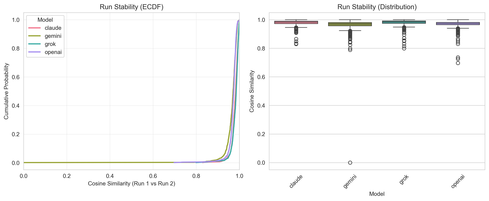
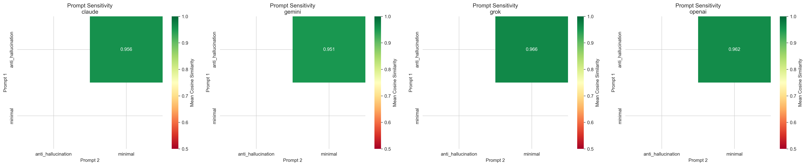
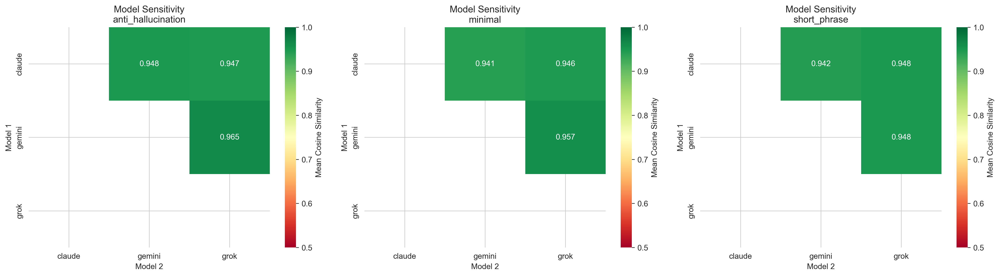
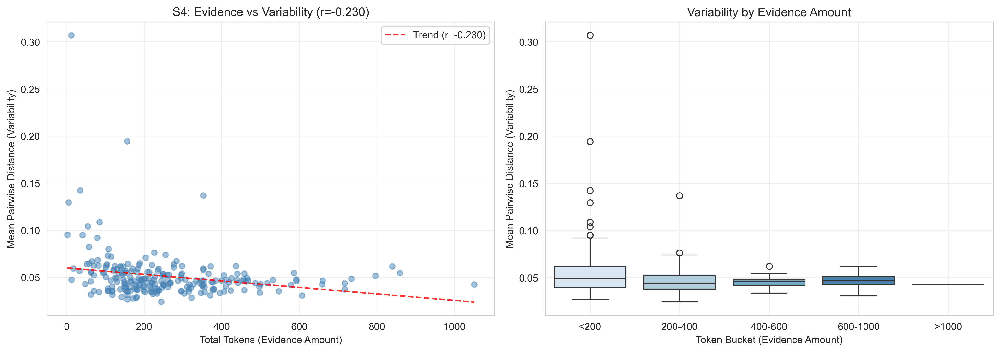
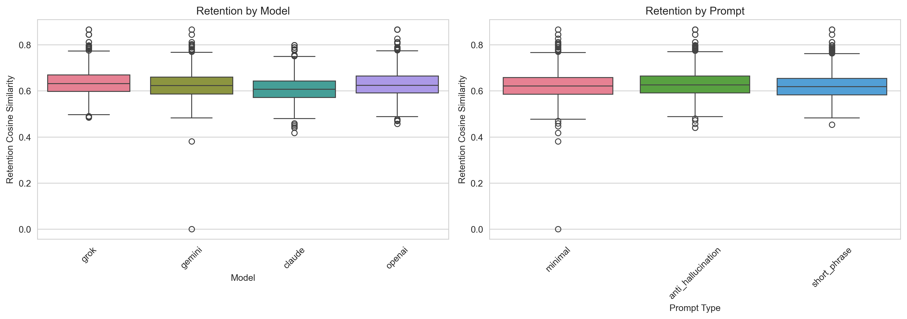
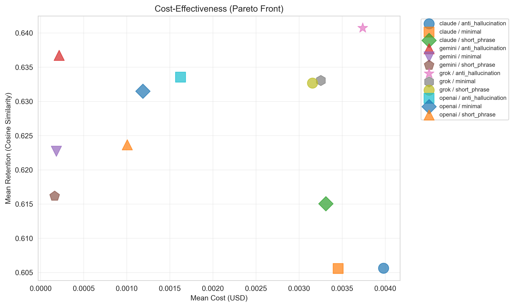
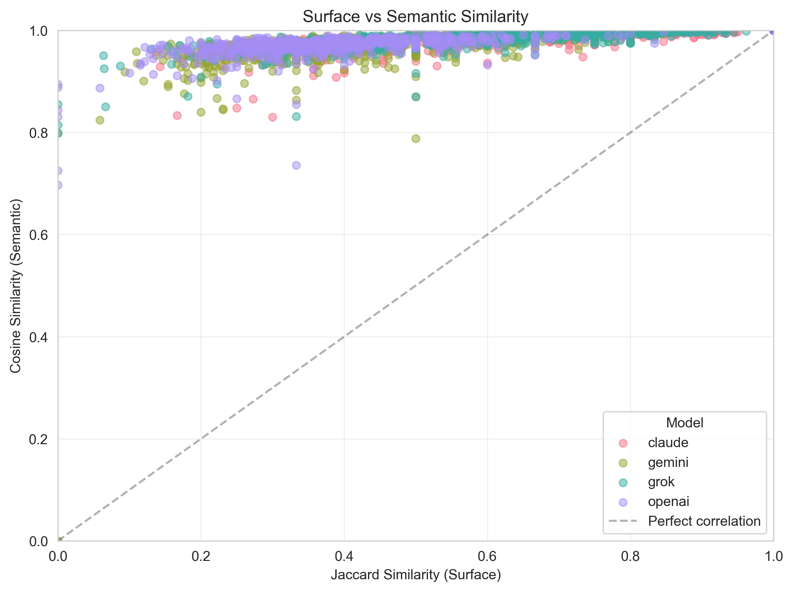

# Gentags Stability Analysis Report

**Date:** 2026-01-24
**Run ID:** week2_run_20251223_191104
**Status:** Complete

---

## Executive Summary

This report presents the complete stability analysis of machine-generated semantic tags (gentags) extracted from venue reviews. The analysis validates the key claim:

> **"Gentags are lexically unstable but semantically stable"**

### Key Findings

| Metric | Value | Target | Status |
|--------|-------|--------|--------|
| Cosine similarity (semantic) | **0.977** | > 0.9 | ✅ |
| Jaccard similarity (surface) | **0.471** | 0.3-0.6 | ✅ |
| Semantic gap (cosine - jaccard) | **0.504** | > 0.3 | ✅ |
| Retention delta vs random | **+0.164** | > 0.1 | ✅ |
| S4 token-variability correlation | **-0.230** | < 0 | ✅ |

**Interpretation:** Different LLM runs produce different words but the same meaning. Representation variability correlates with evidence sparsity, serving as a proxy for epistemic insufficiency.

---

## Data Summary

### Filtering Applied

| Stage | Count |
|-------|-------|
| Total extractions | 13,272 |
| Error extractions removed | 2,898 (21.8%) |
| Venues with all 4 models | 230 |
| Final extractions | 5,517 |
| Final tag rows | 118,832 |

### Extraction Errors by Model

| Model | Errors | Error Rate |
|-------|--------|------------|
| Claude | 1,697 | 51.1% |
| Grok | 1,201 | 36.2% |
| OpenAI | 0 | 0% |
| Gemini | 0 | 0% |

*Note: Analysis filtered to 230 venues with successful extractions from all 4 models to ensure fair comparison.*

---

## S1: Run Stability

**Question:** If I run the same extraction twice, do I get the same meaning?

**Answer:** YES — High semantic stability despite surface variation.

### Results

| Metric | Median | Q1 | Q3 |
|--------|--------|----|----|
| Cosine (semantic) | 0.977 | 0.968 | 0.986 |
| Jaccard (surface) | 0.471 | 0.333 | 0.625 |
| MMC (paraphrase) | 0.887 | 0.839 | 0.927 |
| Gap | 0.504 | — | — |

### By Model and Prompt

| Model | Prompt | Cosine | Jaccard | MMC |
|-------|--------|--------|---------|-----|
| claude | anti_hallucination | 0.988 | 0.645 | 0.936 |
| claude | minimal | 0.981 | 0.558 | 0.906 |
| claude | short_phrase | 0.978 | 0.519 | 0.897 |
| gemini | anti_hallucination | 0.978 | 0.440 | 0.888 |
| gemini | minimal | 0.972 | 0.393 | 0.867 |
| gemini | short_phrase | 0.964 | 0.379 | 0.851 |
| grok | anti_hallucination | 0.985 | 0.800 | 0.910 |
| grok | minimal | 0.970 | 0.667 | 0.865 |
| grok | short_phrase | 0.969 | 0.700 | 0.853 |
| openai | anti_hallucination | 0.980 | 0.455 | 0.880 |
| openai | minimal | 0.974 | 0.364 | 0.855 |
| openai | short_phrase | 0.972 | 0.341 | 0.847 |

### Interpretation

- **High cosine (0.977):** Same meaning across runs
- **Moderate jaccard (0.471):** Different surface forms (paraphrases)
- **Large gap (0.504):** Proves lexical ≠ semantic



---

## S2: Prompt Sensitivity

**Question:** Do prompts change what meaning is extracted, or only the style/granularity?

**Answer:** Prompts affect granularity and style, not core meaning.

### Prompt Characteristics

| Prompt | Behavior |
|--------|----------|
| `anti_hallucination` | More tags, higher granularity, more grounded |
| `minimal` | Moderate tags, balanced |
| `short_phrase` | Fewer tags, more compressed |

### Results

| Model | Prompt 1 | Prompt 2 | Cosine | Jaccard |
|-------|----------|----------|--------|---------|
| claude | anti_hallucination | minimal | 0.962 | 0.370 |
| claude | anti_hallucination | short_phrase | 0.960 | 0.333 |
| claude | minimal | short_phrase | 0.965 | 0.373 |
| gemini | anti_hallucination | minimal | 0.961 | 0.304 |
| gemini | anti_hallucination | short_phrase | 0.949 | 0.241 |
| gemini | minimal | short_phrase | 0.957 | 0.293 |
| grok | anti_hallucination | minimal | 0.972 | 0.375 |
| grok | anti_hallucination | short_phrase | 0.971 | 0.350 |
| grok | minimal | short_phrase | 0.972 | 0.419 |
| openai | anti_hallucination | minimal | 0.969 | 0.333 |
| openai | anti_hallucination | short_phrase | 0.967 | 0.303 |
| openai | minimal | short_phrase | 0.969 | 0.323 |

Semantic similarity remains high (>0.95) across prompt pairs, indicating prompts change resolution but not fundamental meaning.



---

## S3: Model Sensitivity

**Question:** Do different LLMs extract the same latent semantics?

**Answer:** YES — Models share core semantic dimensions despite style differences.

### Results

| Prompt | Model 1 | Model 2 | Cosine | Jaccard |
|--------|---------|---------|--------|---------|
| anti_hallucination | claude | gemini | 0.955 | 0.269 |
| anti_hallucination | claude | grok | 0.954 | 0.283 |
| anti_hallucination | claude | openai | 0.954 | 0.267 |
| anti_hallucination | gemini | grok | 0.972 | 0.346 |
| anti_hallucination | gemini | openai | 0.963 | 0.274 |
| anti_hallucination | grok | openai | 0.974 | 0.357 |
| minimal | claude | gemini | 0.948 | 0.236 |
| minimal | claude | grok | 0.952 | 0.250 |
| minimal | claude | openai | 0.947 | 0.204 |
| minimal | gemini | grok | 0.965 | 0.300 |
| minimal | gemini | openai | 0.953 | 0.222 |
| minimal | grok | openai | 0.963 | 0.273 |

All 4 models produce semantically similar outputs (cosine >0.94) despite different surface forms (jaccard 0.20-0.36). Differences are in:
- Verbosity (number of tags)
- Granularity (specificity)
- Phrasing style

Core extracted meaning remains consistent.



---

## S4: Stability Under Sparsity

**Question:** As textual evidence decreases, does representation variability increase?

**Answer:** YES — **Correlation = -0.230** (negative as expected)

### Results

| Metric | Value |
|--------|-------|
| Token-variability correlation | **-0.230** |
| Mean tokens per venue | ~400 |
| Mean variability | 0.051 |

### By Token Bucket

| Token Bucket | Mean Variability | N Venues |
|--------------|------------------|----------|
| <200 | 0.0568 (highest) | 104 |
| 200-400 | 0.0465 | 87 |
| 400-600 | 0.0454 | 29 |
| 600-1000 | 0.0462 | 9 |
| >1000 | 0.0424 (lowest) | 1 |

### Interpretation

The negative correlation confirms:
- **More evidence (tokens) → less variability**
- **Less evidence → more variability**

This shows variability serves as a **proxy for epistemic insufficiency**, not noise. When representations vary across runs/models, it indicates less constrained semantics — a venue with sparse reviews has weaker semantic grounding.



---

## Retention Analysis

**Question:** Do gentags retain the meaning of the original reviews?

**Answer:** YES — Gentags capture review meaning significantly better than random.

### Results

| Metric | Value |
|--------|-------|
| Retention (cosine to reviews) | 0.625 |
| Random baseline | 0.461 |
| Delta (above random) | **+0.164** |

### Interpretation

Gentags achieve 0.164 higher cosine similarity to their source reviews compared to random tags. This confirms gentags are not arbitrary text fragments but meaningful semantic summaries.



---

## Cost-Effectiveness

**Question:** What is the cost-information tradeoff?

### Results

Different model/prompt combinations offer different cost-quality tradeoffs. See Pareto front for optimal choices.



---

## Surface vs Semantic

**Question:** Why is Jaccard insufficient as a stability measure?

### Results

The scatter plot shows many points where:
- Jaccard is low (surface variation)
- Cosine is high (semantic stability)

This decoupling proves that lexical overlap is not a reliable indicator of semantic similarity.



---

## Conclusions

### Key Claim Validated

> **"Gentags are lexically unstable but semantically stable"**

Evidence:
1. **Gap = 0.504** between cosine (0.977) and Jaccard (0.471)
2. Different runs produce paraphrases, not random noise
3. Retention significantly exceeds random baseline (+0.164)

### Variability is Signal, Not Noise

Evidence:
1. **S4 correlation = -0.230** (negative)
2. More evidence → less variability
3. Variability as proxy for epistemic insufficiency

### Models Share Semantics

Evidence:
1. High cross-model cosine similarity
2. Style differs, meaning agrees
3. Gentags reflect shared cultural/linguistic priors

---

## Technical Details

### Embedding Model

- **Model:** OpenAI `text-embedding-3-large`
- **Dimensions:** 3,072
- **Normalization:** L2 normalized before cosine computation

### Canonical Representations

- **Reviews:** R_mean = mean pooling of per-review embeddings
- **Tags:** T_mean_unique = dedupe by tag_norm_eval, then mean pool

### Metrics

| Metric | Definition |
|--------|------------|
| Cosine similarity | Semantic similarity in embedding space |
| Jaccard similarity | Surface overlap of normalized tag sets |
| MMC | Mean Max Cosine — average best match between tag sets |
| Retention | Cosine(review_embedding, tag_embedding) |

---

## File References

### Tables
- `results/phase2/tables/run_stability.csv`
- `results/phase2/tables/run_stability_summary.csv`
- `results/phase2/tables/prompt_sensitivity.csv`
- `results/phase2/tables/model_sensitivity.csv`
- `results/phase2/tables/retention.csv`
- `results/phase2/tables/uncertainty_dispersion.csv`
- `results/phase2/tables/sparsity_analysis.csv`

### Plots
- `results/phase2/plots/1_run_stability.png`
- `results/phase2/plots/2_prompt_sensitivity.png`
- `results/phase2/plots/3_model_sensitivity.png`
- `results/phase2/plots/4_retention.png`
- `results/phase2/plots/5_cost_effectiveness.png`
- `results/phase2/plots/6_surface_vs_semantic.png`
- `results/phase2/plots/7_sparsity_analysis.png`

### Scripts
- `scripts/phase2_analysis.py`
- `scripts/phase2_plots.py`

---

## Appendix: Raw Data Samples

### Run Stability Sample (first 5 rows)

```
model_key,prompt_type,n,cosine_median,jaccard_median,mmc_median
claude,anti_hallucination,229,0.988,0.645,0.936
claude,minimal,230,0.981,0.558,0.906
claude,short_phrase,229,0.978,0.519,0.897
gemini,anti_hallucination,230,0.978,0.440,0.888
```

### Sparsity Analysis Sample (first 5 rows)

```
venue_id,mean_pairwise_distance,total_tokens,token_bucket
0C3FBm4g9DPjogLP0Ifl,0.062,124,<200
0HzILXSVSUitqiTSUGCJ,0.040,199,<200
0YdU4YMQyVwvq74WdPQZ,0.036,238,200-400
0Ye2hQrkmyGCFDPHg072,0.049,465,400-600
```
